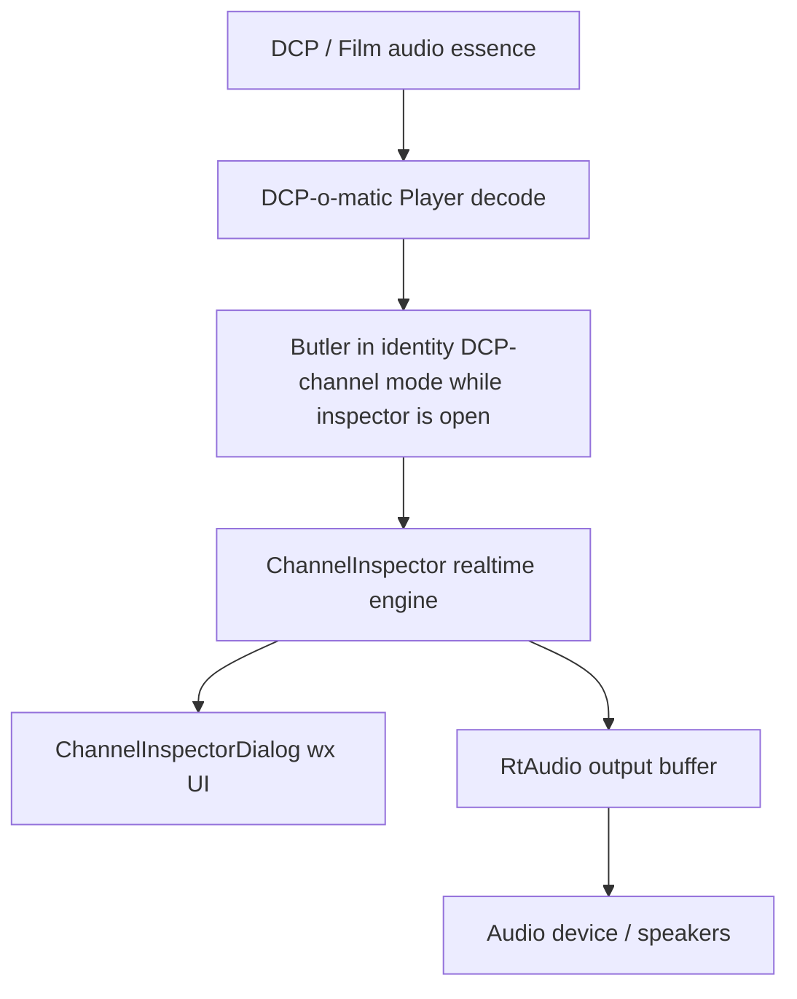
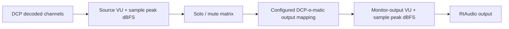
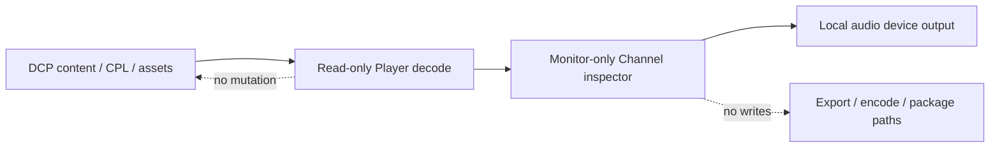
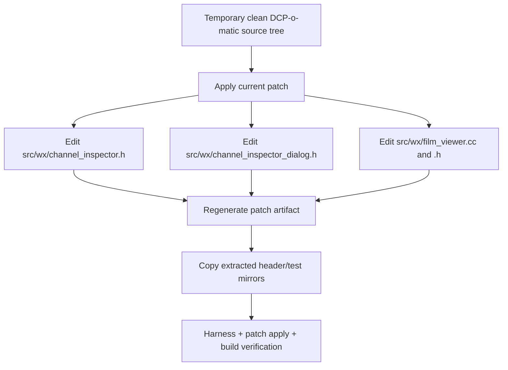

# channel-inspector-meters - Work Plan

## TL;DR (For humans)
The next worker will add source-channel and monitor-output meters to the existing DCP-o-matic Player Channel inspector, keeping everything in one compact window. The visible peak value will be labelled as sample peak dBFS; realtime true peak stays out of this implementation.

The plan preserves the current monitor-only boundary. It changes only the Player listening/inspection path, keeps DCP export and assets untouched, and follows DCP-o-matic's existing wxWidgets dialog style rather than adding a new visual language.

It will NOT add room EQ, REW, X-curve, diagnostic EQ, DKDM/libxml fixes, export changes, or loudness normalization.

**Effort:** Medium
**Risk:** Medium - realtime audio callback safety and patch/copy synchronization are the load-bearing risks.
**Decisions to sanity-check:** source meters before solo/mute, output meters after solo/mute and mapping, sample peak dBFS wording, one combined Channel inspector window.

Your next move: execute this plan in a new session. First re-check GitHub issue #45 for any late developer reply; if none changes direction, implement this plan and run the final verification wave before preparing a revised upstream PR note.

---

> TL;DR (machine): Medium-risk monitor-only wx/C++ patch update; add source/output VU-style level and sample peak dBFS meters, keep patch artifact and extracted copies in sync.

## Scope
### Must have
- Add source-channel meters before solo/mute:
  - VU-style level display.
  - Sample peak dBFS text display.
- Add monitor-output meters after solo/mute and DCP-o-matic output mapping:
  - VU-style level display.
  - Sample peak dBFS text display.
  - Show a combined monitor row using the maximum of metered output channels.
  - Show per-device output rows up to the existing `ChannelInspector::MAX_DEV` clamp.
- Keep one modeless `Tools > Channel inspector...` window.
- Preserve existing solo-in-place behavior.
- Keep the normal Player callback path unchanged while the inspector is closed.
- Keep audio callback work allocation-free and lock-free after inspector activation/configuration.
- Keep the patch artifact and extracted review/test copies synchronized:
  - `patches/dcpomatic-channel-inspector/0001-add-monitor-only-channel-inspector.patch`
  - `patches/dcpomatic-channel-inspector/channel_inspector.h`
  - `patches/dcpomatic-channel-inspector/channel_inspector_dialog.h`
  - `patches/dcpomatic-channel-inspector/tests/inspector_harness.cc`
- Update docs only where needed to describe sample peak dBFS and the two meter points.
- Use English in all source comments and user-facing strings.
- Before coding, re-fetch GitHub issue #45 once. If a new developer reply changes the requested direction, stop and report instead of implementing against stale assumptions.

### Must NOT have (guardrails, anti-slop, scope boundaries)
- No RoomTune, room tuning, Room EQ, playback EQ, REW, EQ-APO, X-curve, Flat, or diagnostic EQ presets.
- No iPhone measurement workflow.
- No DKDM/libxml crash fixes.
- No DCP export, CPL, MXF, asset, encode-path, package, or writer changes.
- No loudness normalization or automatic gain correction.
- No claim that stereo/headphone monitoring replaces theatrical acoustic QC.
- No realtime true-peak claim or implementation. Any upstream VU/true-peak integration beyond this local sample-peak/VU-style plan requires explicit user approval in a later step.
- No decorative UI redesign. Use existing DCP-o-matic wx dialog conventions.

### Meter semantics and reset behavior
- `sample peak dBFS` means the maximum absolute sample value in the latest processed audio callback block for that source or output channel, converted by `20 * log10(linear)`.
- Silence bucket: values at or below `1e-6` display as `-inf` / `-120 dBFS` internally.
- Peak display is not true peak, not peak-hold since window open, and not loudness.
- Peak values reset on `ChannelInspector::configure()` and when the inspector is closed/cleared.
- VU-style value means block RMS smoothed for display:
  - `rms = sqrt(sum(sample * sample) / frames)`.
  - Store/display the smoothed linear RMS value as dBFS.
  - Use 48 kHz as the Player callback sample rate because `FilmViewer` opens RtAudio at 48000 Hz in the current baseline.
  - Suggested smoothing: 300 ms rise and 650 ms fall time constants.
- Meter bar range: -60 dBFS to 0 dBFS. Values below -60 dBFS draw empty; values above 0 dBFS clamp visually to full scale while the text still reports the numeric dBFS value.
- Output meters cover the same clamped output channels used by the monitor matrix: `0..ChannelInspector::MAX_DEV - 1`. The combined monitor row is the maximum level across those metered output rows, not across any unmetered device channels beyond the clamp.
- UI polling cadence follows the current dialog timer: 100 ms unless there is a strong local wx reason to change it.
- Concurrency ownership: the audio callback is the only writer of meter atomics; the UI timer is the reader. UI code must not write meter values or call audio-device APIs.
- Monitor-output metering must use the Player output mapping from `Config::instance()->audio_mapping(_audio_channels)` via the existing `inspector_recompute_matrix()` path. Do not use content-stream input mappings for monitor-output meters.

### Architecture Layers

### Data Flow

### Trust Boundaries

### Implementation Structure

## Verification strategy
> Zero human intervention is required for automated verification; manual GUI/audio QA is recorded separately because it requires a real DCP and listening device.

- Test decision: tests-after, extending the existing standalone C++ harness.
- Primary automated checks:
  - `clang++ -std=c++17 -I patches/dcpomatic-channel-inspector patches/dcpomatic-channel-inspector/tests/inspector_harness.cc -o /tmp/dcpomatic_channel_inspector_harness`
  - `/tmp/dcpomatic_channel_inspector_harness`
  - `git apply --check patches/dcpomatic-channel-inspector/0001-add-monitor-only-channel-inspector.patch` in a clean DCP-o-matic v2.18.44 source tree.
  - Full build attempt: `python3 ./waf build` in a clean patched temp source tree. It is optional only if required dependencies/configuration are unavailable, the machine cannot complete the build, or the attempt exceeds 90 minutes. Record the exact reason if skipped or aborted.
- Scope scans:
  - Search changed patch/docs for forbidden terms: `RoomTune`, `room tuning`, `Room EQ`, `playback EQ`, `REW`, `EQ-APO`, `X-curve`, `Flat`, `diagnostic EQ`, `iPhone`, `DKDM`, `libxml`, `loudness normalization`, `automatic gain`, `CPL`, `MXF`, `asset`, `encode`, `package`, `writer`.
  - Confirm visible strings use `sample peak dBFS`, not `true peak`, for realtime Player meters.
- Numeric tolerances:
  - dBFS checks should pass within 0.5 dB unless a test states a stricter tolerance.
  - Linear sample/matrix checks should pass within `1e-5`.
  - Silence checks should assert less than or equal to -119 dBFS.
- Manual QA fixture:
  - Preferred: a known 5.1 DCP with L/R/C/LFE/Ls/Rs signal.
  - Fallback: any DCP with at least two audio channels plus a documented limitation that surround-channel observations remain unverified.
- UI inspection:
  - Capture or record evidence for 2-channel, 6-channel, and 16-channel layouts.
  - Passing layout means no label/control overlap, source table and monitor-output section are both visible or scrollable, and `Sample peak dBFS` text does not force horizontal clipping at the chosen minimum window size.
- Evidence paths:
  - `.omo/evidence/channel-inspector-meters/harness.txt`
  - `.omo/evidence/channel-inspector-meters/git-apply-check.txt`
  - `.omo/evidence/channel-inspector-meters/build.txt`
  - `.omo/evidence/channel-inspector-meters/scope-scan.txt`
  - `.omo/evidence/channel-inspector-meters/manual-gui-audio.md`

## Execution strategy
### Parallel execution waves
- Wave 1: prepare clean patch workspace and inspect current UI/engine seams.
- Wave 2: implement engine/API, callback metering, and UI layout.
- Wave 3: regenerate patch/mirrors, expand tests/docs, run verification.
- Wave 4: final review, rubric scoring, commit, and PR handoff.

### Dependency matrix
| Todo | Depends on | Blocks | Can parallelize with |
| --- | --- | --- | --- |
| 1 | none | 2, 3, 4, 5 | none |
| 2 | 1 | 3, 5, 6 | 4 after API names are fixed |
| 3 | 2 | 5, 6 | 4 |
| 4 | 1, API names from 2 | 5, 7 | 3 |
| 5 | 2, 3, 4 | 6, 7 | none |
| 6 | 5 | 7, F1-F4 | none |
| 7 | 5, 6 | F1-F4 | none |

## Todos
> Implementation + Test = ONE todo. Never separate.

- [ ] 1. Confirm collaboration gate and prepare a clean DCP-o-matic patch workspace
  What to do / Must NOT do: Re-fetch GitHub issue #45 and confirm there is still no developer reply after the user's proposal that changes the implementation direction. Then create a disposable clean source tree from `/Users/homedcp/src/dcpomatic-stock` at the v2.18.44 validation baseline, apply the current patch, and confirm the patched files match the extracted copies before editing. Do not edit `/Users/homedcp/src/dcpomatic-stock` directly. Do not include local `e2e/` evidence unless the user explicitly asks.
  Parallelization: Wave 1 | Blocked by: none | Blocks: 2, 3, 4, 5
  References (executor has NO interview context - be exhaustive): `AGENTS.md`; `patches/dcpomatic-channel-inspector/0001-add-monitor-only-channel-inspector.patch`; `patches/dcpomatic-channel-inspector/channel_inspector.h`; `patches/dcpomatic-channel-inspector/channel_inspector_dialog.h`
  Acceptance criteria (agent-executable): Issue #45 status is recorded, clean temp tree exists, current patch applies, and extracted copies match patched `src/wx/channel_inspector.h` and `src/wx/channel_inspector_dialog.h` before new edits.
  QA scenarios (name the exact tool + invocation): happy: from the clean temp source tree run `git apply --check /Users/homedcp/Claude/Projects/dcpomatic-channel-inspector/patches/dcpomatic-channel-inspector/0001-add-monitor-only-channel-inspector.patch`; failure: deliberately run check from wrong baseline and record that the plan requires v2.18.44. Evidence `.omo/evidence/channel-inspector-meters/task-1-workspace.txt`
  Commit: N | planning/setup only

- [ ] 2. Extend `ChannelInspector` with source and output meter state
  What to do / Must NOT do: Replace the single `_peak` concept with explicit source and output meter arrays. Add realtime-safe methods such as `meter_source(float const* mid, unsigned int frames)` and `meter_output(float const* out, unsigned int frames)`. Add accessors for source VU, source sample peak dBFS, output VU, output sample peak dBFS, output combined VU, and output combined sample peak dBFS. Keep arrays fixed-size, atomics relaxed, and all heap allocation in `configure()`, not in the callback. Use `MAX_DCP` for source rows and `MAX_DEV` for output metering; preserve `_output_channels` as the actual RtAudio stride. Use the meter semantics and reset behavior defined in this plan. Do not integrate upstream true-peak/VU code in this implementation; note it as a future option only if discovered.
  Parallelization: Wave 2 | Blocked by: 1 | Blocks: 3, 5, 6
  References: `patches/dcpomatic-channel-inspector/channel_inspector.h`; existing `meter()`, `downmix()`, `peak_dbfs()`, `configure()`
  Acceptance criteria (agent-executable): Harness can feed known source and output buffers and observe independent source/output sample peak dBFS values and VU-style values without changing solo/mute state, within the numeric tolerances in this plan.
  QA scenarios: happy: harness verifies source and output meters differ after matrix/downmix and reset on `configure()`/`clear()`; failure: silent channels return the existing `-inf` bucket and zero/empty configuration does not process. Evidence `.omo/evidence/channel-inspector-meters/task-2-engine.txt`
  Commit: Y | `Add channel inspector source and output meters.`

- [ ] 3. Meter the actual monitor output after solo/mute and mapping
  What to do / Must NOT do: In the active inspector branch of `FilmViewer::audio_callback`, call source metering on the DCP-channel mid buffer before downmix, then call output metering immediately after `downmix()` fills the RtAudio output buffer. Keep the inactive callback path byte-for-byte equivalent except for unavoidable patch context. Expose new `FilmViewer` accessors for source/output meter values to the dialog. Do not add locks, allocations, or UI calls inside the audio callback. Preserve `Config::instance()->audio_mapping(_audio_channels)` as the monitor-output mapping source.
  Parallelization: Wave 2 | Blocked by: 2 | Blocks: 5, 6
  References: `patches/dcpomatic-channel-inspector/0001-add-monitor-only-channel-inspector.patch` FilmViewer callback hunk; `/Users/homedcp/src/dcpomatic-stock/src/wx/film_viewer.cc`
  Acceptance criteria: Patch diff shows output metering happens after `ChannelInspector::downmix()` and before returning from the callback; inactive branch still gets audio directly from Butler into `out_p`.
  QA scenarios: happy: harness or targeted inspection confirms output meter uses output stride, not DCP channel count; failure: oversized callback branch remains silence-only and does not read meter buffers out of bounds. Evidence `.omo/evidence/channel-inspector-meters/task-3-callback.txt`
  Commit: Y | same implementation commit as Todo 2 if inseparable

- [ ] 4. Redesign the one-window wx UI without breaking DCP-o-matic style
  What to do / Must NOT do: Keep `ChannelInspectorDialog` as one modeless window. Use existing wx patterns: `wxBoxSizer`, `wxFlexGridSizer` or `wxGridBagSizer`, bold section headings, normal `wxCheckBox`, `wxStaticText`, `DCPOMATIC_DIALOG_BORDER`, `DCPOMATIC_SIZER_*` gaps, and dark-mode-aware colours from `gui_is_dark()`. Add a small local reusable meter bar widget in the dialog header. Layout should be source-channel rows first, then a `Monitor output` section with `Mix` and per-output rows. Avoid wide table overflow by putting monitor-output meters below or beside the source table depending on sizer fit; prefer vertical stacking if in doubt.
  Parallelization: Wave 2 | Blocked by: 1 and API names from 2 | Blocks: 5, 7
  References: `patches/dcpomatic-channel-inspector/channel_inspector_dialog.h`; `/Users/homedcp/src/dcpomatic-stock/src/wx/audio_dialog.cc`; `/Users/homedcp/src/dcpomatic-stock/src/wx/audio_plot.cc`; `/Users/homedcp/src/dcpomatic-stock/src/wx/wx_util.h`
  Acceptance criteria: Dialog shows columns/labels for `VU` and `Sample peak dBFS` for source channels, plus a clearly separated `Monitor output` section; text fits at 2-channel, 6-channel, and 16-channel layouts using scrolling or sensible minimum sizes; refresh timer remains 100 ms unless explicitly justified in the evidence.
  QA scenarios: happy: compile check plus visual/manual inspection evidence for 2-channel, 6-channel, and 16-channel layouts; failure: simulated 16-channel DCP/output layout remains scrollable and does not clip controls or flicker excessively. Evidence `.omo/evidence/channel-inspector-meters/task-4-ui.md`
  Commit: Y | same implementation commit as Todos 2-3 if inseparable

- [ ] 5. Regenerate patch artifact and extracted mirrors
  What to do / Must NOT do: After implementing in the disposable DCP-o-matic source tree, regenerate `0001-add-monitor-only-channel-inspector.patch` from `git diff` with normal `a/` and `b/` prefixes. Copy the patched `src/wx/channel_inspector.h` and `src/wx/channel_inspector_dialog.h` back to the extracted mirror files. Update `tests/inspector_harness.cc` in the repo directly or from the same implementation logic. Do not manually edit only the patch without validating against a real source tree.
  Parallelization: Wave 3 | Blocked by: 2, 3, 4 | Blocks: 6, 7
  References: `patches/dcpomatic-channel-inspector/0001-add-monitor-only-channel-inspector.patch`; `patches/dcpomatic-channel-inspector/channel_inspector.h`; `patches/dcpomatic-channel-inspector/channel_inspector_dialog.h`; `patches/dcpomatic-channel-inspector/tests/inspector_harness.cc`
  Acceptance criteria: Reapplying the regenerated patch to clean source produces files identical to extracted mirrors for the two header copies, and the harness source in the repo matches the tested harness logic.
  QA scenarios: happy: checksum compare mirror files vs patched source files; failure: intentionally compare before copy to ensure mismatch detection command catches drift. Evidence `.omo/evidence/channel-inspector-meters/task-5-sync.txt`
  Commit: Y | implementation commit

- [ ] 6. Expand automated harness and documentation
  What to do / Must NOT do: Add harness tests for source sample peak, output sample peak, VU-style levels, combined monitor output, silent channels, and wide output stride. Update docs to describe the two meter points and sample peak dBFS wording. Keep docs clear that the feature requires rebuilding DCP-o-matic Player from source. Do not add claims about true peak or loudness normalization. The English-only rule applies to source comments and UI/user-facing strings in code; existing Korean documentation may be updated in Korean when that document is already Korean.
  Parallelization: Wave 3 | Blocked by: 5 | Blocks: 7, F1-F4
  References: `patches/dcpomatic-channel-inspector/tests/inspector_harness.cc`; `README.md`; `patches/dcpomatic-channel-inspector/README.md`; `docs/channel-inspector-build-and-use.md`; `docs/채널-인스펙터-설계.md`
  Acceptance criteria: Harness reports `ALL PASS (0 failures)` and docs contain `sample peak dBFS` for realtime Player metering.
  QA scenarios: happy: compile/run harness; failure: scope scan rejects docs if `True peak` is introduced in the realtime inspector section or if any forbidden scope term appears in a changed patch/doc context as a new feature. Evidence `.omo/evidence/channel-inspector-meters/task-6-tests-docs.txt`
  Commit: Y | implementation/docs commit, split only if docs are separable and requested

- [ ] 7. Run final technical validation and prepare upstream handoff
  What to do / Must NOT do: Run patch apply check, harness, forbidden-scope scan, and the full build attempt under the exact optional-build rule above. Write the final rubric scores requested by the user, each criterion 1.0-10.0 in 0.1 increments. Report improvement opportunities and wait for user approval before doing optional polish beyond the approved scope.
  Parallelization: Wave 4 | Blocked by: 5, 6 | Blocks: F1-F4
  References: `AGENTS.md`; `.omo/plans/channel-inspector-meters.md`; `docs/channel-inspector-meter-handoff.md`
  Acceptance criteria: Verification evidence files exist and final summary includes per-criterion rubric scores, not only an average.
  QA scenarios: happy: all automated checks pass; failure: if full build is impractical, record exact reason and still run patch apply + harness + scope scan. Evidence `.omo/evidence/channel-inspector-meters/task-7-final.txt`
  Commit: Y | final implementation/handoff commit if needed

## Final verification wave
> Runs in parallel after ALL todos. ALL must APPROVE. Surface results and wait for the user's explicit okay before declaring complete.

- [ ] F1. Plan compliance audit
  Verify every Must have is implemented, every Must NOT have is absent, diagrams still match the final design, and source/output meter placement matches this plan.
- [ ] F2. Code quality review
  Review realtime callback safety, atomic state, buffer strides, meter math, UI ownership, and patch/mirror synchronization.
- [ ] F3. Real manual QA or explicit manual-pending record
  With a real DCP in Player, verify source meters move before solo/mute, monitor-output meters change with solo/mute, close/reopen resets state, and stereo/headphone monitoring remains usable. If no DCP/listening fixture is available, record `MANUAL QA PENDING` with the missing fixture and do not claim manual QA is complete.
- [ ] F4. Scope fidelity
  Confirm no EQ, room tuning, export, CPL, asset, DKDM/libxml, loudness normalization, or true-peak claim entered the patch.

## Commit strategy
- For this planning/handoff turn, use one docs/planning commit:
  - `Add channel inspector meter handoff plan.`
- For the later implementation turn, prefer one atomic implementation commit if the engine, callback, UI, harness, and patch artifact are inseparable:
  - `Add source and output meters to channel inspector.`
- Split docs-only follow-up only if the code change is already verified and the docs can be reviewed independently.
- Never stage unrelated `e2e/` evidence unless the user explicitly asks.
- Before each commit, inspect `git diff --staged --stat` and enough staged diff to prove scope.

## Success criteria
- Clean DCP-o-matic v2.18.44 accepts the regenerated patch with `git apply --check`.
- Standalone harness reports `ALL PASS (0 failures)`.
- If practical, full clean patched DCP-o-matic build links `dcpomatic2_player`.
- Channel inspector UI remains one modeless DCP-o-matic-style wx window, with layout evidence for 2-channel, 6-channel, and 16-channel cases.
- Source meters reflect DCP-channel signal before solo/mute.
- Monitor-output meters reflect the actual post-solo/mute/post-mapping output buffer.
- Visible realtime peak labels say `sample peak dBFS`; no realtime true-peak implementation or claim is included.
- No forbidden scope terms or code paths are introduced.
- Final report includes the requested rubric, with each item scored separately from 1.0 to 10.0 in 0.1 increments:
  - Standards fit.
  - DCP QC purpose fit.
  - Upstream friendliness.
  - Realtime audio safety.
  - UI fit with DCP-o-matic.
  - Monitor-only scope fidelity.
  - Test/verification confidence.
  - PR/handoff clarity.
