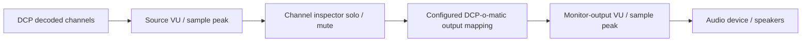

# DCP-o-matic Channel Inspector Memory

Last updated: 2026-08-26 KST, after meter-integration execution plan and handoff.

## Mission

Prepare an upstream-friendly PR for one feature only: a monitor-only audio
Channel inspector in DCP-o-matic Player.

The feature adds `Tools > Channel inspector...` to Player for per-DCP-channel
solo, mute, and dBFS peak monitoring during playback. It must not alter CPLs,
assets, exports, encoding, or DCP content.

Current collaboration direction: proceed with direct meter integration because
there has been no developer reply after the GitHub issue #45 follow-up proposal.
Before coding, re-check issue #45 once; if a late developer reply changes the
direction, stop and report. Otherwise integrate solo/mute and meters into one
shared Player monitoring UI instead of creating competing meter/inspector
windows.

## Hard Exclusions

Do not add or reintroduce any of these scopes:

- RoomTune or room-tuning workflows
- Room EQ or playback EQ
- REW, EQ-APO, X-curve, Flat, or diagnostic EQ presets
- iPhone measurement app material
- DKDM or libxml2 crash fixes
- DCP export, CPL, asset, or encode-path changes

## Source Of Truth

- Patch artifact:
  `patches/dcpomatic-channel-inspector/0001-add-monitor-only-channel-inspector.patch`
- Extracted review/test copies that must stay in sync with the patch:
  `patches/dcpomatic-channel-inspector/channel_inspector.h`
  `patches/dcpomatic-channel-inspector/channel_inspector_dialog.h`
  `patches/dcpomatic-channel-inspector/tests/inspector_harness.cc`
- Build/use docs must clearly say this is used after rebuilding
  DCP-o-matic Player from source.
- Collaboration proposal for the developer:
  `docs/channel-inspector-meter-collaboration-proposal.md`
- Execution plan for meter integration:
  `.omo/plans/channel-inspector-meters.md`
- Handoff document for the next session:
  `docs/channel-inspector-meter-handoff.md`

Use clean DCP-o-matic v2.18.44 source as the validation baseline. The preferred
local clean tree is `/Users/homedcp/src/dcpomatic-stock`. Treat
`/Users/homedcp/src/dcpomatic` as potentially dirty unless checked first.

## Current Repository State

- Local repo: `/Users/homedcp/Claude/Projects/dcpomatic-channel-inspector`
- Remote: `https://github.com/HomeDCP/dcp_ch_ins_pat.git`
- Current branch: `main`
- `main` is pushed to `origin/main` through `18855bb Merge remote main.`
- Feature branch `codex-channel-inspector-monitor-only` is also pushed.
- Local `.omo/` and `e2e/` may contain QA/build evidence and should not be
  broadly staged unless the user explicitly asks. The approved plan file
  `.omo/plans/channel-inspector-meters.md` is an explicit exception.
- `docs/channel-inspector-meter-collaboration-proposal.md` is an English
  proposal document for discussion on GitHub issue #45.
- `docs/channel-inspector-meter-handoff.md` is the handoff document for the
  next implementation session.
- `.omo/plans/channel-inspector-meters.md` is the approved execution plan.

Recent important commits:

- `684f42d Fix channel inspector monitor bounds.`
- `30e316f Add GPL license and tidy patch paths.`
- `513a874 Remove legacy room-tuning artifacts.`
- `18855bb Merge remote main.`

## Verified Work

Known passing checks from the latest completed run:

- Patch applies cleanly to DCP-o-matic v2.18.44 with `git apply --check`.
- Standalone inspector harness reports `ALL PASS (0 failures)`.
- Full clean temp-tree `python3 ./waf build` completed and linked
  `dcpomatic2_player`.

Safety fixes already included:

- Inspector shutdown destroys the identity-mode Butler before clearing active
  inspector mode, avoiding a transient callback/channel-width mismatch.
- Output-device width is separated from the 16-column monitor matrix width, so
  devices with more than 16 output channels do not overrun the matrix.

## Developer / GitHub Context

GitHub issue:
`https://github.com/cth103/dcpomatic/issues/45`

Developer comment summary:

- The features are welcome.
- The developer is currently adding VU meters.
- Solo/mute would fit well with the VU meter work, likely in the same UI.
- Global EQ should be elsewhere, possibly a menu, and is not part of this
  Channel inspector scope.
- PRs are welcome.
- Source code comments should be in English only.

User already replied with the cleaned repository:
`https://github.com/HomeDCP/dcp_ch_ins_pat`

Posted English follow-up position:

- Agree with aligning solo/mute to the developer's VU meter UI.
- Propose two meter points:
  1. source-channel meters before solo/mute, to prove each DCP channel contains
     signal;
  2. monitor-output meters after solo/mute and DCP-o-matic output mapping, to
     show what is actually sent to the listening device.
- Ask whether first implementation should show sample peak dBFS rather than
  realtime true peak, unless the VU meter work already has a realtime-safe
  true-peak path.
- Ask whether output metering should be one combined monitor meter or one meter
  per physical output channel.

Follow-up proposal was posted by the user on issue #45. As of the 2026-08-26
KST connector check, there is no later developer reply after that proposal.
User has approved proceeding with implementation directly.

## Meter Integration Design Notes

Recommended signal chain for discussion:



Rationale:

- Source meters answer DCP QC: is there signal in L/R/C/LFE/Ls/Rs or other DCP
  channels before local monitor choices?
- Output meters answer listening confidence: what sound is actually leaving the
  Player after solo/mute and the user's configured output mapping?
- For realtime Player UI, label peak as sample peak dBFS. Do not implement or
  claim realtime true peak in this implementation; any upstream VU/true-peak
  integration requires fresh user approval.
- True peak should not be casually claimed in the Player callback because
  ITU-R BS.1770 true-peak implies oversampling/filtering behavior.
- DCP-o-matic already has offline sample peak, true peak, integrated loudness,
  and loudness range concepts in `AudioAnalysis`; avoid duplicating that scope
  unless the developer explicitly wants it.

## Next Steps

Immediate implementation step:

1. Read `docs/channel-inspector-meter-handoff.md`.
2. Read `.omo/plans/channel-inspector-meters.md`.
3. Re-check GitHub issue #45 once for any late developer reply.
4. If no new developer reply changes direction, execute the plan:
   Channel inspector controls plus source-channel VU/sample peak dBFS plus
   monitor-output VU/sample peak dBFS in one UI.

Before any revised PR handoff:

1. Re-run `git apply --check` on clean DCP-o-matic v2.18.44.
2. Re-run the standalone harness.
3. If practical, repeat a clean temp-source `python3 ./waf build`.
4. Do manual Player GUI/audio QA with a real DCP.
5. Decide whether to delete or ignore local `.omo/` and `e2e/` evidence.
6. Prepare the upstream PR text around the monitor-only scope and the approved
   VU meter integration direction.

Minimal harness command:

```bash
clang++ -std=c++17 -I patches/dcpomatic-channel-inspector \
  patches/dcpomatic-channel-inspector/tests/inspector_harness.cc \
  -o /tmp/dcpomatic_channel_inspector_harness
/tmp/dcpomatic_channel_inspector_harness
```
