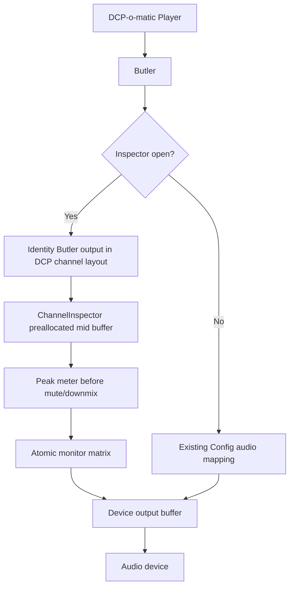

# DCP-o-matic Player Channel Inspector

Monitor-only audio channel inspection patch for DCP-o-matic Player.

This repository branch is scoped to one upstreamable feature: add a
`Tools > Channel inspector...` window to DCP-o-matic Player so a user can
listen to individual DCP audio channels and verify channel activity during
playback.

No room tuning, playback EQ, measurement workflow, DKDM/libxml fix, or export
path change is part of this branch.

## Feature Summary

| Area | Behavior |
|---|---|
| Target app | DCP-o-matic Player v2.18.44 |
| UI entry | `Tools > Channel inspector...` |
| Controls | Per-DCP-channel `Solo` and `Mute` checkboxes |
| Metering | Per-DCP-channel peak level display in dBFS |
| Playback scope | Monitor-only; affects Player listening output while the window is open |
| DCP scope | Does not modify CPLs, assets, export output, or encoded DCP data |
| Channel support | Up to 16 DCP channels and up to 16 output-device channels |
| Routing | Solo-in-place: selected channels keep the normal configured output mapping |

## Files

| Path | Purpose |
|---|---|
| `patches/dcpomatic-channel-inspector/0001-add-monitor-only-channel-inspector.patch` | Patch to apply to clean DCP-o-matic v2.18.44 source |
| `patches/dcpomatic-channel-inspector/channel_inspector.h` | Header-only realtime inspection engine copy for review/testing |
| `patches/dcpomatic-channel-inspector/channel_inspector_dialog.h` | Header-only wx UI copy for review |
| `patches/dcpomatic-channel-inspector/tests/inspector_harness.cc` | Small standalone engine smoke test |
| `docs/channel-inspector-review.md` | Aggressive review report and remaining PR-readiness notes |

## Architecture



## Apply And Build

```bash
cd ~/src/dcpomatic
git checkout v2.18.44
git apply /Users/homedcp/Claude/Projects/roomtunning/patches/dcpomatic-channel-inspector/0001-add-monitor-only-channel-inspector.patch
python3 ./waf configure --prefix=$HOME/dcpomatic-env --wx-config="$(brew --prefix wxwidgets)/bin/wx-config" --c++17 --disable-tests
python3 ./waf build
```

The focused build and usage guide is
`docs/channel-inspector-build-and-use.md`.

## Use

1. Open a DCP in DCP-o-matic Player.
2. Start playback.
3. Open `Tools > Channel inspector...`.
4. Use `Solo` to isolate one or more DCP channels while preserving the normal
   output mapping.
5. Use `Mute` to remove individual channels from the monitor output.
6. Watch the `Peak` column to confirm whether each DCP channel has signal.
7. Close the window to reset solo/mute state and return to the normal playback
   path.

## Verification

Current branch checks:

```bash
clang++ -std=c++17 -I patches/dcpomatic-channel-inspector \
  patches/dcpomatic-channel-inspector/tests/inspector_harness.cc \
  -o /tmp/dcpomatic_channel_inspector_harness
/tmp/dcpomatic_channel_inspector_harness
```

Observed result: `ALL PASS (0 failures)`.

Additional checks completed:

| Check | Result |
|---|---|
| Patch contains no `Room`, `EQ`, `REW`, `X-curve`, `DKDM`, `roomtune`, or `RoomTune` strings | PASS |
| `git apply --check` against clean local DCP-o-matic v2.18.44 source | PASS |
| Full DCP-o-matic `python3 ./waf build` in a clean temp source tree | PASS, `[518/518] dcpomatic2_player` linked |

## PR Scope

Proposed PR title:

`Add monitor-only audio channel inspector to Player`

One-line scope:

`This adds a Player-only Channel inspector window for per-channel solo/mute monitoring and dBFS peak checks without changing DCP content or export output.`
