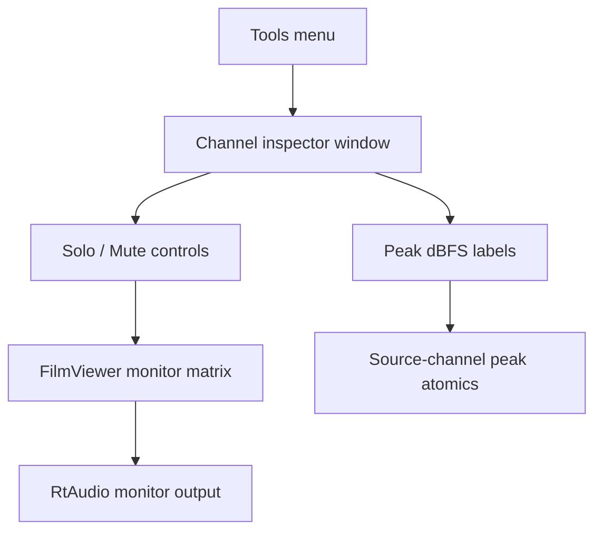

# Build and use the DCP-o-matic Player Channel inspector

This document explains how to rebuild DCP-o-matic Player from source, apply the
monitor-only Channel inspector patch, and use the feature.

## 1. Start From Clean DCP-o-matic Source

```bash
git clone --branch v2.18.44 https://github.com/cth103/dcpomatic.git ~/src/dcpomatic-channel-inspector
cd ~/src/dcpomatic-channel-inspector
```

If you already have a clean v2.18.44 checkout, use that instead.

## 2. Prepare The Build Environment

The local Apple Silicon build used Homebrew dependencies plus DCP-o-matic's
source-built sibling libraries. The important configure shape is:

```bash
python3 ./waf configure --prefix=$HOME/dcpomatic-env \
  --wx-config="$(brew --prefix wxwidgets)/bin/wx-config" \
  --c++17 --disable-tests
```

Notes:

- `--c++17` is needed for the local libxml++/glibmm/cairomm/pangomm stack.
- `ffmpeg@7` was used locally.
- EBUR128-patched FFmpeg was not required for this Player monitor feature.
- The local full build was verified on Apple Silicon and linked `dcpomatic2_player`.

## 3. Apply The Patch

From the clean DCP-o-matic checkout:

```bash
git apply /Users/homedcp/Claude/Projects/roomtunning/patches/dcpomatic-channel-inspector/0001-add-monitor-only-channel-inspector.patch
```

Optional preflight:

```bash
git apply --check /Users/homedcp/Claude/Projects/roomtunning/patches/dcpomatic-channel-inspector/0001-add-monitor-only-channel-inspector.patch
```

## 4. Build

```bash
python3 ./waf build
```

The verified local build completed with:

```text
[518/518] Linking build/src/tools/dcpomatic2_player
'build' finished successfully
```

## 5. Run

```bash
./build/src/tools/dcpomatic2_player
```

Open a DCP, start playback, then use `Tools > Channel inspector...`.

## 6. What The Patch Adds



The patch adds a modeless Channel inspector window. Opening it temporarily
switches Player's preview audio path to keep DCP source channels separate until
the audio callback applies the monitor matrix. Closing the window clears the
monitoring state and restores the normal path.

## 7. Expected Use Cases

| Use case | How to check |
|---|---|
| Stereo monitoring of 5.1 DCP | Solo C, LFE, Ls, Rs and confirm each can be heard according to the configured mapping |
| Channel activity check | Watch peak dBFS for each row during playback |
| Unexpected channel bleed | Solo one channel at a time and listen for content that belongs elsewhere |
| Physical speaker check | On multichannel hardware, solo each mapped channel and confirm it plays from the expected speaker |

## 8. Current Limitations

- Peak display is instantaneous per callback; there is no hold/decay UI yet.
- The window is a `wxFrame` rather than `wxDialog` because macOS wxDialog testing
  showed unwanted close/cancel behavior from child checkbox command events.
- Manual GUI/audio QA is still required with real DCP playback before opening an
  upstream PR.
