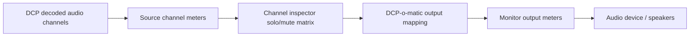
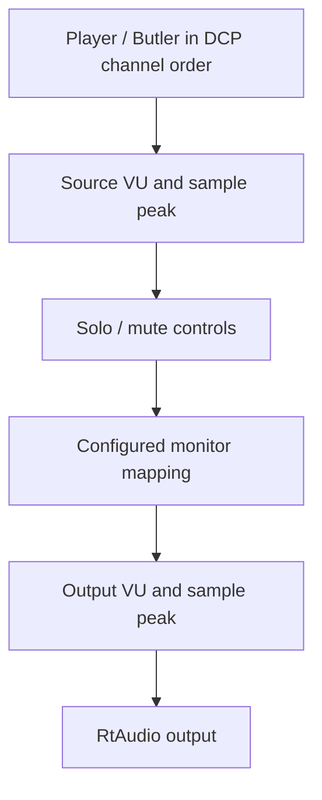
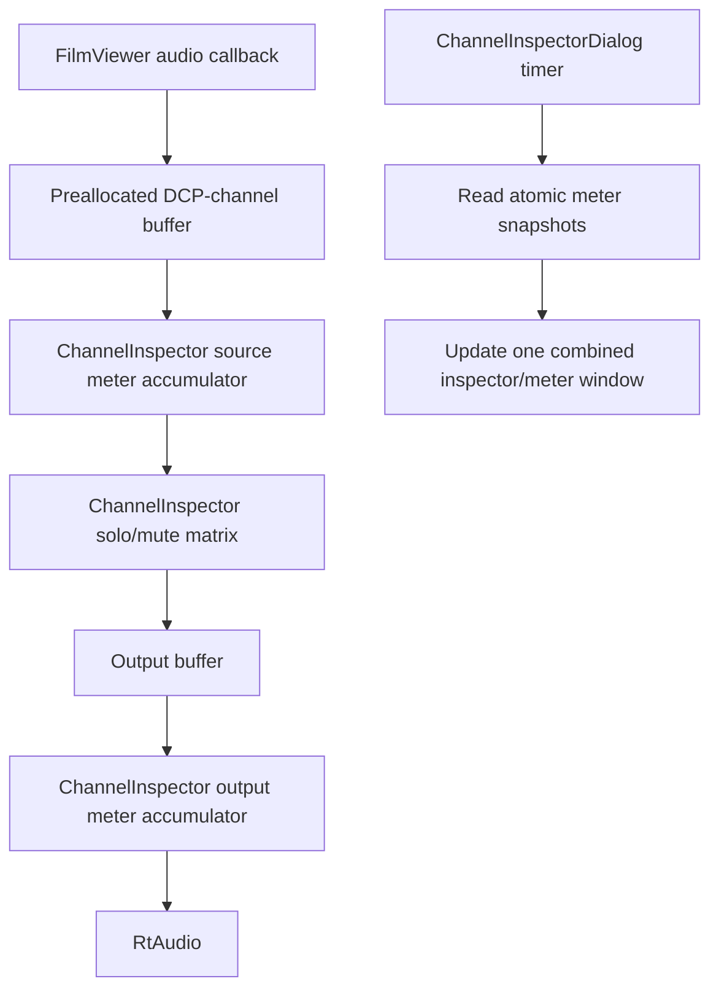

# Channel Inspector Meter Integration Proposal

## Purpose

I opened a Channel inspector issue and pull request for DCP-o-matic Player, but
I would like to align the next step with the existing VU meter work before
writing more code.

The goal is still narrow: help users who do not have a physical 5.1 or 7.1
monitoring setup check whether a DCP has audio in the expected channels, and
whether the Player monitoring output is wired as expected. This should remain a
Player-only monitoring feature. It should not change CPLs, assets, exports,
encoding, DCP packaging, or audio processing for created DCPs.

## Proposed Signal Chain

My current understanding is that a useful inspection path should expose two
different meter points:

The important distinction is:

| Meter point | What it answers |
|---|---|
| Source channel meters, before solo/mute | Does the DCP channel itself contain signal? |
| Monitor output meters, after solo/mute and output mapping | What signal is actually being sent to the listening device? |

This means the Channel inspector would not only be an isolation tool. It would
also show both the original DCP-channel activity and the actual post-inspector
monitor output.

## Why Both Meter Points Seem Useful

For DCP QC, a source-channel meter is important because it verifies channel
content before any local monitoring choice changes it. For example, it can show
that `C` or `LFE` contains signal even when the user is monitoring through a
stereo or headphone setup.

For listening confidence, an output meter is also useful because solo/mute and
the configured DCP-o-matic audio output mapping decide what the user actually
hears. That output meter answers: "after my solo/mute choices, what is going to
the audio device?"

So the proposed order is:

## Proposed UI Direction

The existing `Channel inspector` window could become a single combined monitor
panel:

| Channel | Solo | Mute | Source VU | Source Peak |
|---|---|---|---|---|
| L | checkbox | checkbox | meter | dBFS |
| R | checkbox | checkbox | meter | dBFS |
| C | checkbox | checkbox | meter | dBFS |
| LFE | checkbox | checkbox | meter | dBFS |
| Ls | checkbox | checkbox | meter | dBFS |
| Rs | checkbox | checkbox | meter | dBFS |

Then add a small output section below or to the side:

| Output | VU | Peak |
|---|---|---|
| Device output / combined monitor | meter | dBFS |

If the in-progress VU meter already has a preferred widget, data model, or
ballistics behavior, I would rather reuse that instead of introducing a second
meter implementation.

## Peak Meter Wording

I suggest initially using clear wording such as `sample peak dBFS`, unless the
existing VU meter work already includes a realtime-safe true-peak path.

True peak is a more specific standard concept and usually implies oversampling
or filtering behavior. DCP-o-matic already has offline true-peak/loudness
analysis elsewhere, but the Player callback should stay simple, lock-free, and
safe.

## Implementation Shape If This Direction Is Acceptable

Implementation principles:

- Keep the normal Player audio path unchanged when the inspector is closed.
- Keep the inspector monitor-only.
- Keep audio callback work allocation-free and lock-free.
- Reuse the developer's VU meter code if possible.
- Preserve DCP-o-matic's configured output mapping.
- Keep solo behavior "solo in place" rather than inventing a new downmix rule.

## Questions Before Coding

1. Would you prefer the meters to be integrated into the existing/developing VU
   meter code first, with the Channel inspector using that shared meter model?

2. Does the two-point meter design make sense for Player QC?
   - source-channel meters before solo/mute
   - monitor-output meters after solo/mute and output mapping

3. For the first version, is `sample peak dBFS` acceptable, with true-peak left
   to existing offline analysis or a later realtime implementation?

4. Should the UI show one combined output meter, or one meter per physical
   output channel?

## Out Of Scope

This proposal intentionally does not include:

- room tuning
- room EQ
- REW or EQ-APO workflows
- X-curve, Flat, or diagnostic EQ presets
- iPhone measurement workflows
- DKDM or libxml fixes
- CPL, asset, export, encode, or DCP package changes
- loudness normalization or automatic gain correction

## References

- DCP-o-matic sound output mapping:
  https://dcpomatic.com/manual/html/ch11s08.html
- SMPTE ST 429-2:2023 D-Cinema Packaging - DCP Operational Constraints:
  https://doc.smpte-doc.org/st429-2-private/main/
- DCI Digital Cinema System Specification:
  https://www.dcimovies.com/dci-specification/
- ITU-R BS.1770-5 loudness and true-peak recommendation:
  https://www.itu.int/rec/R-REC-BS.1770-5-202311-I
- EBU Tech 3341 EBU Mode metering:
  https://tech.ebu.ch/fr/publications/tech3341
- IEC 60268-17 standard volume indicators:
  https://webstore.iec.ch/en/publication/1216
