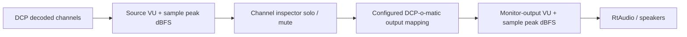

# Channel Inspector Meter Integration Handoff

Last updated: 2026-08-26 KST

## Current Status

The project is moving from collaboration wait mode to direct implementation.
The DCP-o-matic developer said the solo/mute feature would fit well with his
in-progress VU meter work, but there has been no reply after the follow-up
proposal on GitHub issue #45. The approved direction is now to implement the
meter integration directly while preserving the developer's intent: one shared
Player monitoring UI, no global EQ, and English-only source comments.

Before coding, re-check GitHub issue #45 once. If a late developer reply changes
the direction, stop and report instead of implementing against stale
assumptions.

Primary plan:

- `.omo/plans/channel-inspector-meters.md`

Related proposal:

- `docs/channel-inspector-meter-collaboration-proposal.md`

GitHub issue:

- `https://github.com/cth103/dcpomatic/issues/45`

## Goal

Extend the existing monitor-only Channel inspector patch so DCP-o-matic Player
shows both:

1. source-channel meters before solo/mute, proving each decoded DCP channel has
   signal; and
2. monitor-output meters after solo/mute and DCP-o-matic output mapping,
   showing what is actually sent to the listening device.

The visible realtime peak value must be labelled as `sample peak dBFS`.
Realtime true peak is out of scope for this implementation. Any upstream
VU/true-peak integration beyond the local sample-peak/VU-style plan requires
explicit user approval in a later step.

Meter behavior:

- `sample peak dBFS` is per latest processed audio callback block, not true
  peak and not peak-hold since the window opened.
- VU is a VU-style smoothed RMS display: block RMS with 300 ms rise and 650 ms
  fall at the Player's 48 kHz callback rate.
- Meter bars should use -60 dBFS to 0 dBFS as the visual range.
- Silence at or below `1e-6` should display as `-inf` or the internal
  `-120 dBFS` bucket.
- Peak/VU values reset when the inspector is configured, closed, or cleared.
- The audio callback writes meter atomics; the UI timer reads them at the
  current 100 ms cadence.
- Monitor-output metering must use `Config::instance()->audio_mapping(_audio_channels)`
  through the existing `inspector_recompute_matrix()` path, not content-stream
  input mappings.
- For devices with more than `ChannelInspector::MAX_DEV` outputs, meter only
  the same clamped output range used by the monitor matrix. The `Mix` row is
  the max across those visible/metered output rows.

## Signal Chain



## Files To Treat As Source Of Truth

- `patches/dcpomatic-channel-inspector/0001-add-monitor-only-channel-inspector.patch`
- `patches/dcpomatic-channel-inspector/channel_inspector.h`
- `patches/dcpomatic-channel-inspector/channel_inspector_dialog.h`
- `patches/dcpomatic-channel-inspector/tests/inspector_harness.cc`
- `.omo/plans/channel-inspector-meters.md`

Keep the patch artifact and extracted review/test copies synchronized.

## Implementation Route

Use a disposable clean DCP-o-matic source tree instead of editing the stock tree
directly.

1. Re-fetch issue #45 and record whether any new developer reply exists.
2. Create a temporary clean source tree from `/Users/homedcp/src/dcpomatic-stock`
   at the v2.18.44 validation baseline.
3. Apply `patches/dcpomatic-channel-inspector/0001-add-monitor-only-channel-inspector.patch`.
4. Implement changes in the temporary DCP-o-matic source tree:
   - `src/wx/channel_inspector.h`
   - `src/wx/channel_inspector_dialog.h`
   - `src/wx/film_viewer.cc`
   - `src/wx/film_viewer.h`
5. Regenerate the patch from that temporary source tree.
6. Copy the extracted header mirrors back into this repository.
7. Update and run the standalone harness.
8. Run patch apply, scope scan, and build verification.

## UI Direction

Keep the UI as one `Channel inspector` window. Do not create a separate meter
window.

Preferred layout:

- top/source section:
  - `Channel`
  - `Solo`
  - `Mute`
  - `VU`
  - `Sample peak dBFS`
- bottom/monitor-output section:
  - `Mix`
  - per output channel up to `ChannelInspector::MAX_DEV`
  - `VU`
  - `Sample peak dBFS`

Follow existing DCP-o-matic wxWidgets conventions:

- `wxBoxSizer`, `wxFlexGridSizer`, or `wxGridBagSizer`
- bold section headers
- simple `wxCheckBox` and `wxStaticText`
- `DCPOMATIC_DIALOG_BORDER` and `DCPOMATIC_SIZER_*` spacing
- dark-mode-aware colours via existing wx utilities
- compact, readable meters rather than decorative audio hardware styling

## Must Not Change

- No RoomTune or room tuning.
- No Room EQ, playback EQ, REW, EQ-APO, X-curve, Flat, or diagnostic EQ presets.
- No iPhone measurement workflow.
- No DKDM/libxml fixes.
- No DCP export, CPL, asset, MXF, encode, package, or writer changes.
- No loudness normalization or automatic gain correction.
- No realtime true-peak claim for the Player meters.
- No upstream true-peak/VU integration without a fresh user approval.

## Verification Commands

Harness:

```bash
clang++ -std=c++17 -I patches/dcpomatic-channel-inspector \
  patches/dcpomatic-channel-inspector/tests/inspector_harness.cc \
  -o /tmp/dcpomatic_channel_inspector_harness
/tmp/dcpomatic_channel_inspector_harness
```

Patch check, from a clean DCP-o-matic source tree:

```bash
git apply --check /Users/homedcp/Claude/Projects/dcpomatic-channel-inspector/patches/dcpomatic-channel-inspector/0001-add-monitor-only-channel-inspector.patch
```

Optional full build, from a clean patched DCP-o-matic source tree:

```bash
python3 ./waf build
```

The full build is optional only if required dependencies/configuration are
unavailable, the machine cannot complete the build, or the attempt exceeds 90
minutes. Record the exact reason if skipped or aborted.

Numeric tolerances for harness checks:

- dBFS checks within 0.5 dB.
- Linear sample/matrix checks within `1e-5`.
- Silence less than or equal to -119 dBFS.

Manual QA fixture:

- Preferred: a known 5.1 DCP with L/R/C/LFE/Ls/Rs signal.
- Fallback: any DCP with at least two audio channels, with surround-channel
  observations recorded as unverified.
- If no DCP/listening fixture is available, record `MANUAL QA PENDING` and do
  not claim manual QA is complete.

UI inspection:

- Record evidence for 2-channel, 6-channel, and 16-channel layouts.
- Passing layout means no label/control overlap, source table and monitor-output
  section are visible or scrollable, and `Sample peak dBFS` text does not force
  horizontal clipping at the chosen minimum window size.

## Final Report Requirements

After implementation and verification, report the rubric scores separately,
not only as an average. Use 1.0-10.0 scores in 0.1 increments.

Rubric:

- Standards fit.
- DCP QC purpose fit.
- Upstream friendliness.
- Realtime audio safety.
- UI fit with DCP-o-matic.
- Monitor-only scope fidelity.
- Test/verification confidence.
- PR/handoff clarity.

If improvements remain, brief them and wait for explicit user approval before
doing optional polish beyond the approved scope.

## Prompt For A New Session

```text
We are continuing the DCP-o-matic Player Channel inspector meter integration.

Repository:
/Users/homedcp/Claude/Projects/dcpomatic-channel-inspector

Read these first:
- AGENTS.md, if present locally
- docs/channel-inspector-meter-handoff.md
- .omo/plans/channel-inspector-meters.md
- patches/dcpomatic-channel-inspector/0001-add-monitor-only-channel-inspector.patch
- patches/dcpomatic-channel-inspector/channel_inspector.h
- patches/dcpomatic-channel-inspector/channel_inspector_dialog.h
- patches/dcpomatic-channel-inspector/tests/inspector_harness.cc

Task:
Execute the plan in .omo/plans/channel-inspector-meters.md. First re-check
GitHub issue #45 and stop if a late developer reply changes the direction. If
not, add source-channel
VU/sample peak dBFS meters before solo/mute, and monitor-output VU/sample peak
dBFS meters after solo/mute and DCP-o-matic output mapping, all in the existing
Channel inspector window. Keep it monitor-only and do not implement realtime
true peak or upstream VU/true-peak integration without fresh user approval.

Important:
- Do not add RoomTune, EQ, REW, X-curve, DKDM/libxml, export, CPL, asset, MXF,
  encode, package, loudness normalization, or automatic gain work.
- Keep patch artifact and extracted mirror files synchronized.
- Use a disposable clean DCP-o-matic source tree from /Users/homedcp/src/dcpomatic-stock;
  do not edit the stock tree directly.
- Run the standalone harness, patch apply check, forbidden scope scan, and full
  build attempt under the documented optional-build rule.
- At the end, report per-category rubric scores from 1.0 to 10.0 in 0.1 increments
  and wait for approval before optional polish.
```
