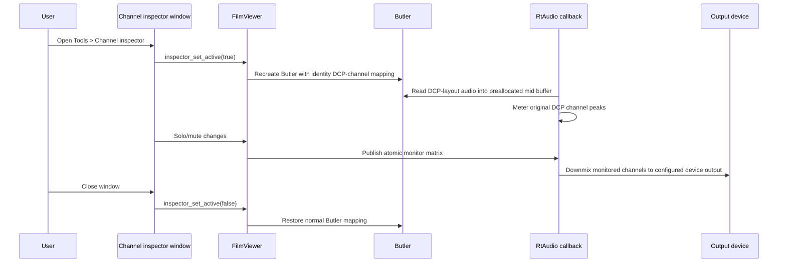

# Monitor-only Channel Inspector Review

Review date: 2026-08-08

## Objective

Prepare an independent branch for one purpose only:

> Add a monitor-only Channel inspector to DCP-o-matic Player.

Room tuning, REW/EQ-APO playback EQ, X-curve filters, diagnostic EQ presets,
iPhone measurement workflows, and DKDM/libxml maintenance fixes are outside
this branch.

## Review Verdict

| Area | Verdict | Notes |
|---|---:|---|
| Scope | Fixed in new patch | New patch excludes Room EQ, diagnostic EQ, X-curve, REW, and DKDM material |
| Header-only engine build | Fixed | `static constexpr` constants remove the previous link failure |
| Realtime matrix handoff | Fixed | Replaced two-slot mutable matrix handoff with atomic gain cells |
| Callback buffer bounds | Fixed | Callback uses inspector path only when `frames <= configured block size`; otherwise emits silence while active |
| Inspector shutdown ordering | Fixed | Stops the Butler before clearing active inspector mode, avoiding a transient identity-output/channel-count mismatch in the audio callback |
| Wide output devices | Fixed | Clamps monitor matrix columns to 16 while preserving the actual audio-device output stride |
| DCP-o-matic build | Pass | Full clean temp-tree `waf build` completed through `dcpomatic2_player` |
| Manual GUI/audio QA | Still needed | Requires actual DCP playback and speaker/headphone monitoring |

## Architecture



## Aggressive Review Findings

### Fixed Blockers

| Finding | Original risk | Fix |
|---|---|---|
| Combined patch was not monitor-only | Room EQ UI, parser, X-curve, diagnostic EQ, and DKDM material made the upstream goal unclear | Created `patches/dcpomatic-channel-inspector/0001-add-monitor-only-channel-inspector.patch` with only solo/mute/peak inspection |
| Standalone harness failed to link | `static const` members were ODR-used without definitions | Changed inspector constants to `static constexpr` |
| Two-slot matrix publication was unsafe | GUI could overwrite the slot read by the audio callback | Replaced double-buffer matrix with per-cell `std::atomic<float>` |
| `_inspector_active` was shared across threads | Plain bool read by callback and written by UI thread | Changed to `std::atomic<bool>` |
| Mid-buffer capacity was assumed | Callback ignored blocks larger than the configured buffer | Added `can_process(frames)` guard and silent output fallback while inspector is active |
| Inspector close could briefly mismatch Butler/output widths | Active flag could become false before the identity Butler was destroyed, letting the normal callback path read DCP-width audio into a device-width buffer | Stop/destroy the Butler before changing active state and recreating it |
| 17+ output-channel devices could exceed matrix width | `_audio_channels` could drive writes past the 16-column monitor matrix and use a clamped stride in the callback | Clamp matrix columns to `ChannelInspector::MAX_DEV`, store the actual output stride separately, and add a standalone regression case |

### Remaining Before PR

| Priority | Item | Recommendation |
|---|---|---|
| P0 | Manual playback QA | Test a 5.1 DCP on stereo output and, if available, a multichannel device |
| P0 | Legacy branch cleanup | Remove old room-tuning/EQ/DKDM files from the final PR branch once explicit deletion approval is available |
| P1 | Upstream style polish | Consider moving `ChannelInspectorDialog` implementation to `.cc` if upstream dislikes large header-only wx classes |
| P1 | UX wording | Confirm whether the menu label should be `Channel inspector...`, `Audio channel inspector...`, or another existing DCP-o-matic style |
| P2 | Meter behavior | Peak has no decay/hold; acceptable for v1, but note it in PR if asked |

## Legacy Files To Remove From The Final PR Branch

The active monitor-only patch and documentation live under
`patches/dcpomatic-channel-inspector/` plus this branch README and design docs.
The following older files are still present in the repository history/worktree
but should not be part of an upstream Channel inspector PR:

| Path | Reason |
|---|---|
| `patches/roomtune-playback-eq/` | Playback EQ patch, unrelated to monitor-only inspection |
| `patches/roomtune-channel-inspector/` | Older combined EQ + inspector patch superseded by `patches/dcpomatic-channel-inspector/` |
| `patches/libxml2-dkdm-crash-fix/` | Separate DKDM/libxml maintenance fix |
| `examples/room_eq.example.conf` | Room EQ example config |
| `docs/측정-룸튜닝-워크플로.md` | Room tuning measurement workflow |
| `docs/개발명세서.md` | Earlier iPhone/Mac room tuning app spec |
| `docs/개발환경-셋업가이드.md` | Earlier room tuning app setup guide |
| `docs/리서치-종합.md` | Broad room tuning research |
| `docs/DCP-o-matic-빌드계획.md` | Earlier build-gate plan for a room tuning fork |
| `scripts/roomtune-env.sh` | RoomTune-named local build environment helper |
| `scripts/roomtune-tools.env.sh` | Stock-vs-EQ local helper script |

## Verification Evidence

Commands run locally:

```bash
clang++ -std=c++17 -I patches/dcpomatic-channel-inspector \
  patches/dcpomatic-channel-inspector/tests/inspector_harness.cc \
  -o /tmp/dcpomatic_channel_inspector_harness
/tmp/dcpomatic_channel_inspector_harness
```

Result: `ALL PASS (0 failures)`.

```bash
git apply --check patches/dcpomatic-channel-inspector/0001-add-monitor-only-channel-inspector.patch
```

Result: pass against a clean local DCP-o-matic v2.18.44 source tree.

```bash
python3 ./waf configure --prefix=$HOME/dcpomatic-env \
  --wx-config="$(brew --prefix wxwidgets)/bin/wx-config" \
  --c++17 --disable-tests
python3 ./waf build
```

Result: full build finished successfully and linked `dcpomatic2_player`.
