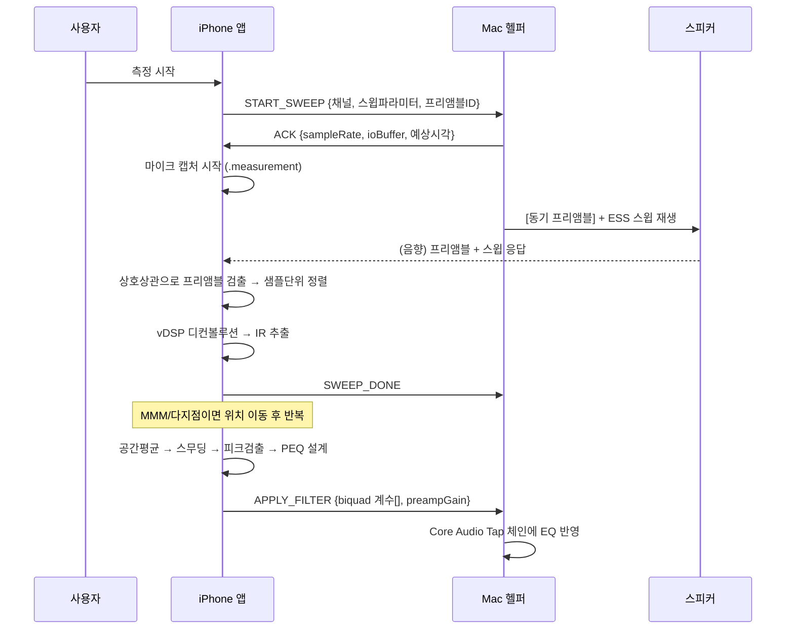
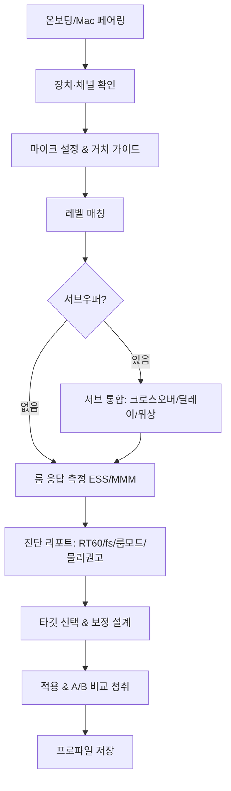

# 룸튜닝 솔루션 개발명세서

> **코드네임:** RoomTune (가칭)
> **버전:** Spec v1.0
> **작성일:** 2026-07-07
> **한 줄 정의:** 아이폰을 계측기로, 맥을 재생·보정 엔진으로 사용하여 소스기기(Mac)의 출력 스피커 시스템을 무선으로 룸튜닝하는 iOS + macOS 통합 솔루션.

---

## 0. 확정된 스코핑 결정 (Locked Decisions)

| # | 항목 | 결정 | 근거 |
|---|------|------|------|
| D1 | iPhone 프론트엔드 | **네이티브 iOS 앱 (SwiftUI)** | measurement 모드·USB-C 계측마이크·vDSP 정밀처리·로컬네트워크 API에 완전 접근 필요 |
| D2 | 마이크 전략 | **내장 우선 + USB-C 외장 계측마이크 옵션** | 진입장벽↓ + 정밀 경로 확보 (Kardous & Shaw: 오차 주원인=마이크) |
| D3 | v1 채널 범위 | **2.0 / 2.1** (5.1/7.1 확장 가능 설계) | 룸튜닝 핵심가치(저역/서브 정합)에 집중, 빠른 출시 |
| D4 | 최소 macOS | **macOS 14.2+** | Core Audio Taps로 가상 드라이버·재부팅·관리자설치 불필요 (경량화) |

---

## 1. 개요 및 목표

### 1.1 문제 정의
소스기기(1차: Mac, 2차: PC)에서 재생되는 사운드가 **청취 위치에서 얼마나 정확하게 들리는지**는 스피커 자체보다 **방(room)** 이 좌우한다. 특히 저역에서 룸모드(정재파)가 15~25dB의 피크/딥을 만들어 청취 경험을 왜곡한다. 본 솔루션은 이를 측정·진단하고, 보정 가능한 문제는 EQ로 자동 보정하여 시스템 출력에 반영한다.

### 1.2 핵심 목표
1. Mac 출력장치를 자동 감지하고 채널 구성(2.0/2.1)을 인식한다.
2. 아이폰 마이크로 룸 응답(임펄스응답/주파수응답)을 측정한다.
3. 음향학적으로 타당한 보정필터를 자동 설계한다 (**피크 cut 중심, 딥 부스트 금지**).
4. 보정을 **드라이버 설치 없이** 시스템 출력에 적용한다 (macOS 14.2+ Core Audio Taps).
5. 튜닝 전/후를 비교 청취할 수 있게 한다.

### 1.3 비목표 (Non-goals, v1)
- 5.1/7.1/Atmos 멀티채널 (v2 확장)
- Windows/PC 소스 지원 (v2~v3)
- 물리 음향처리(흡음재/베이스트랩) 자동 설계 — **진단·권고만 제공**
- fs(슈뢰더 주파수) 이상 중·고역의 좁은 노치 EQ — 원칙적으로 하지 않음

### 1.4 설계 철학 (음향학 근거에서 도출한 불변 규칙)
> 이 규칙들은 UI 옵션이 아니라 **엔진에 하드코딩되는 안전장치**다.

- **R1 — 대역 분리:** EQ 보정은 슈뢰더 주파수 `fs ≈ 2000·√(RT60/V)` **이하**로 국한한다. fs는 측정된 RT60과 사용자 입력 룸 부피로 자동 산출하며, 소형룸은 대략 200~300Hz.
- **R2 — Cut-only 우선, 딥 부스트 금지:** 상쇄로 생긴 딥(null)은 비최소위상이라 EQ로 못 채운다. 넓고 얕은 딥만 소폭 보정 허용, 좁고 깊은 딥은 **부스트 금지**.
- **R3 — 게인 상한:** 개별 필터 및 총 부스트 게인에 상한(기본 +6dB)을 강제한다 (헤드룸 소진·클리핑 방지).
- **R4 — 타깃은 플랫이 아니다:** 음악=Harman 하향틸트(약 -1dB/oct) + 저역 룸게인(+4~8dB), 시네마=SMPTE X-curve(소형룸 부적합 경고 표기).
- **R5 — 시간영역 문제 분리:** RT60·모달 링잉·SBIR·조기반사는 EQ 대상이 아니다 → "물리처리 권고" 진단 리포트로 라우팅.
- **R6 — 공간 평균 필수:** 단일지점 측정을 최종 보정 근거로 쓰지 않는다 (MMM 또는 다지점).
- **R7 — 마이크 보정 필수:** measurement 모드는 응답을 평탄하게 만들지 않는다. 마이크 종류에 맞는 캘리브레이션 역보정을 항상 적용한다.
- **R8 — 신뢰 대역 표시:** 내장 마이크는 20~50Hz 심저역·절대SPL을 신뢰할 수 없다. 측정 UI에 신뢰 대역을 명시한다.

---

## 2. 음향학 배경 요약 (구현자용 레퍼런스)

| 개념 | 핵심 수식 / 값 | 구현 함의 |
|------|----------------|-----------|
| 슈뢰더 주파수 | `fs ≈ 2000·√(RT60/V)` (RT60 초, V m³) | EQ 상한 주파수 자동 결정 |
| 축 모드 | `f = n·c/(2L)`, c=343 m/s | 룸 치수 입력 시 예상 모드 오버레이 |
| SBIR 딥 | `f = c/(2d)`, d=스피커-경계 거리 | 배치 조정 안내(EQ 불가) |
| 룸게인 시작 | λ ≈ 룸 최장치수×2 (반파장) | 타깃 저역 슬로프 근거 |
| 서브 크로스오버 | THX 80Hz (위성은 상향) | 베이스 매니지먼트 기본값 |
| LFE LPF | 120Hz (스피커 크로스오버와 별개) | 2.1 서브 경로 |
| 딜레이 | 343 m/s → 2.9 ms/m, 48kHz서 1ms≈48샘플 | 채널 딜레이 계산 |
| 서브 추가지연 | DSP로 +3~10 ms (실측 필요) | 물리거리만으론 부정확 |
| 레벨 기준 | 핑크노이즈, 가정 75dB / 시네마 85dB, C-Slow | 레벨 매칭 목표값 |

> ⚠️ 룸게인 슬로프(7~9 vs 12 dB/oct), 서브 추가지연, X-curve 근거 등은 룸·장비마다 크게 달라지는 값이다. **고정 상수로 가정하지 말고 측정 기반으로 처리**한다.

---

## 3. 시스템 아키텍처

### 3.1 역할 분리
```
 ┌─────────────────────────┐         Wi-Fi (동일 LAN)          ┌──────────────────────────────┐
 │        iPhone 앱         │   Bonjour/mDNS + WebSocket(TLS)   │        Mac 헬퍼앱 (메뉴바)      │
 │   (계측기 + 리모컨)       │◀────────────────────────────────▶│   (재생 엔진 + DSP + 라우팅)     │
 │                         │                                  │                              │
 │ • 마이크 캡처(.measurement)│                                  │ • 출력장치/채널 감지 (Core Audio)│
 │ • ESS/MMM 측정          │  ── 측정 시작/정지 명령 ──▶          │ • 테스트 스윕 → 실제 스피커 재생 │
 │ • vDSP 디컨볼루션/IR/RTA  │  ◀── 재생상태/장치정보 ──           │ • Core Audio Tap 시스템 EQ 적용 │
 │ • 보정필터 설계          │  ── 필터계수(PEQ) 전송 ──▶          │ • 필터계수 → biquad DSP 반영   │
 │ • 결과 시각화/저장        │                                  │ • 프리셋 저장/토글            │
 └─────────────────────────┘                                  └──────────────────────────────┘
```

### 3.2 왜 이 분리인가
- **튜닝 대상은 Mac의 출력 스피커**이므로 테스트 신호는 반드시 Mac의 실제 출력 체인을 통해 나가야 한다 → **Mac이 재생**한다.
- 마이크는 청취 위치에 있어야 하고 이동이 자유로워야 한다(MMM) → **iPhone이 녹음**한다.
- 브라우저 샌드박스는 Core Audio HAL 접근·시스템 오디오 라우팅이 불가하므로 **Mac은 네이티브 헬퍼앱**이어야 한다(웹앱 단독 불가 — 검증 완료).

### 3.3 측정 시퀀스 (핵심 동기화)


**동기화 원리:** Mac·iPhone은 공통 오디오 클럭이 없다(수 ppm 드리프트). 네트워크 타임스탬프로는 샘플단위 정렬 불가. → **스윕 앞에 짧은 동기 프리앰블(예: 처프/노이즈 버스트)을 삽입**하고, iPhone 녹음에서 참조 스윕과의 **정규화 상호상관(cross-correlation)** 으로 시작 샘플을 검출한다. 이 방식은 상대 IR 형상 추출에 충분하다. (절대 그룹지연/거리가 필요하면 루프백 기준 보정을 추가.)

---

## 4. Mac 헬퍼앱 명세

### 4.1 형태
- **메뉴바 앱** (LSUIElement, Dock 아이콘 없음). 백그라운드 상주.
- 언어: **Swift / SwiftUI + AppKit(메뉴바)**.
- 배포: Developer ID 서명 + **notarization**, DMG 또는 PKG. App Store 외 직접 배포(시스템 오디오 접근 특성상).

### 4.2 출력장치 감지 모듈
- API: Core Audio HAL C API.
  - 기본 출력장치: `AudioObjectGetPropertyData` + `kAudioHardwarePropertyDefaultOutputDevice`.
  - 장치명: `kAudioObjectPropertyName` / `kAudioDevicePropertyDeviceNameCFString`.
  - 채널 구성: `kAudioDevicePropertyStreamConfiguration` (AudioBufferList의 `mNumberChannels` 합산) → **2ch → 2.0/2.1**, 6ch → 5.1, 8ch → 7.1 자동 판별.
  - 스트림 포맷/샘플레이트: `kAudioStreamPropertyVirtualFormat`.
- 장치 변경 감지: `AudioObjectAddPropertyListener`로 기본 출력장치 변경 콜백 등록 → iPhone에 push.
- **2.1 판별 주의:** macOS는 2ch 장치를 스테레오로만 노출한다. 서브우퍼가 물리적으로 있는지는 하드웨어가 알려주지 않으므로 **사용자에게 "서브우퍼 있음/없음"을 명시적으로 질문**한다(2.0 vs 2.1 분기).

### 4.3 테스트 신호 재생 모듈
- 대상 스피커로 정확히 라우팅: **`AudioDeviceCreateIOProcIDWithBlock`** 으로 대상 `AudioDeviceID`에 직접 IOProc를 붙여 재생.
  - ⚠️ `AVAudioEngine`의 `kAudioOutputUnitProperty_CurrentDevice` 지정은 noErr를 반환해도 **조용히 기본 장치로 되돌아가는 버그**가 있으므로 사용하지 않는다.
- 재생 콘텐츠: 동기 프리앰블 + ESS 스윕, 핑크노이즈(레벨/MMM용), 채널별 개별 재생(2.1이면 L / R / Sub 순차).

### 4.4 시스템 EQ 적용 모듈 (핵심)
- **경로: Core Audio Taps (macOS 14.2+)** — 가상 드라이버 없음.
  1. `CATapDescription`(UUID, mono/stereo mixdown, muteBehavior) 생성.
  2. `AudioHardwareCreateProcessTap`으로 시스템(또는 특정 프로세스) 출력 캡처.
  3. Tap + 실제 출력장치를 **aggregate device**로 결합.
  4. Tap 입력 → **biquad 캐스케이드 EQ DSP** → aggregate의 실제 출력으로 렌더.
- DSP: 채널별 biquad(PEQ) 캐스케이드 + preamp 게인(부스트로 인한 클리핑 방지용 음수 게인). 32-bit float 처리.
- 권한: **시스템 오디오 녹음(캡처) 권한** 필요 → 최초 실행 시 사용자 승인. 메뉴바에 캡처 활성 표시.
- 바이패스: 원클릭 EQ On/Off (전/후 비교).
- 프리셋: 룸/채널구성별 필터셋 저장·전환.

> **폴백(선택):** macOS 13 이하 지원이 필요해지면 `AudioServerPlugIn`(userspace HAL 플러그인, /Library/Audio/Plug-Ins/HAL, notarization + 관리자 설치) 경로를 별도 모듈로 추가. **v1 범위 밖.**

### 4.5 로컬 서버 / 디스커버리 모듈
- Bonjour/mDNS 광고: `NWListener` (Network.framework), 서비스 타입 예 `_roomtune._tcp`.
- 제어 채널: **WebSocket**(로컬 TLS, self-signed + 페어링 코드) 또는 HTTP. 저지연 양방향.
- 페어링: iPhone이 서비스 발견 → 6자리 코드로 1회 페어링 → 이후 자동 재연결.

---

## 5. iPhone 앱 명세

### 5.1 형태 / 스택
- **SwiftUI** 앱. 최소 iOS 버전: **iOS 17.0** (USB-C 오디오는 15+/17.4 개선, 하한은 17로 잡아 API 일관성 확보 — 최종 확정 시 실기 검증).
- 오디오: `AVAudioSession` + `AVAudioEngine`.
- DSP: **Accelerate / vDSP** (FFT/IFFT/디컨볼루션/RTA).
- 통신: Network.framework (`NWBrowser` 디스커버리 + WebSocket).

### 5.2 오디오 세션 설정
```swift
let session = AVAudioSession.sharedInstance()
try session.setCategory(.playAndRecord, mode: .measurement, options: [.allowBluetoothA2DP])
try session.setActive(true)
// preferred 값은 '힌트'일 뿐 → setActive 후 실제값 재조회하여 보정 기준으로 사용
try session.setPreferredSampleRate(48_000)
try session.setPreferredIOBufferDuration(0.005)
let actualSR = session.sampleRate            // ← 실제값 사용
let actualBuf = session.ioBufferDuration      // ← 실제값 사용
```
- **주의:** `.measurement` 모드는 AGC/보이스프로세싱을 최소화하지만 **응답을 평탄하게 만들지 않는다**(재현성↑ ≠ flat). 마이크 캘리브레이션 역보정을 반드시 적용(R7).
- 입력 게인 API는 iOS 13~15에서 깨졌다가 16에서 복구된 이력이 있어 **실기 검증 필수**.

### 5.3 마이크 선택 (이원 전략, D2)
- **외장 우선:** `availableInputs`에서 USB 오디오 클래스 포트(계측마이크)를 발견하면 `setPreferredInput`으로 선택.
- **내장 마이크:** `AVAudioSessionPortBuiltInMic` → `dataSources`에서 `location`/`orientation`으로 마이크 선택, `setPreferredPolarPattern(.omnidirectional)` 지정(저역 선형성).
- USB-C 계측마이크(iPhone 15+): iOS 17.4의 USB Audio Class로 드라이버 없이 인식. 버스파워 ≤500mA 준수 장치(iMM-6C, UMIK-1/2)만. 고전력 인터페이스는 셀프파워드 허브 경고.

### 5.4 마이크 캘리브레이션 (R7)
- **내장 마이크:** 앱에 **모델별 보정 프로파일** 내장(특히 ~100Hz 이하 롤오프 보상). 프로파일 없는 모델은 세대 근사값 + "저역 신뢰 제한" 경고.
- **외장 마이크:** 시리얼별 `.cal`/`.txt`/`.csv` 캘리브레이션 파일 로드(UMIK/iMM-6C 표준 포맷 파싱).
- 역보정: 측정 IR의 크기응답에 마이크 응답의 역함수를 곱한다.
- **신뢰 대역 메타데이터:** 마이크 종류에 따라 신뢰 하한(내장 ≈100Hz, 외장 ≈20Hz)을 측정결과에 태깅 → 그래프에 음영 표시(R8).

### 5.5 측정 파이프라인 (vDSP)
```
[재생/녹음] Mac 재생 ⇄ iPhone installTap 캡처 (동시)
        │
[정렬]   프리앰블 상호상관 → 시작 샘플 검출 → 오프셋 제거
        │
[IR]     r[t] = IFFT( FFT(recording) / FFT(reference_sweep) )   // ESS 디컨볼루션
        │  (선형 IR만 시간윈도우로 절취, 고조파 성분 폐기)
        │
[FR]     IR → FFT → 크기/위상 응답
        │
[Cal]    마이크 캘리브레이션 역보정 적용
        │
[Avg]    MMM/다지점: 크기 dB평균 + 위상 벡터평균 + 그룹지연 산술평균
        │
[Smooth] 심리음향 스무딩(저역 1/3oct, 고역 1/6oct 가변, 피크 가중)
        │
[RT60]   Schroeder 적분 → RT60 → fs 산출 (EQ 상한 결정)
```
- FFT: 실수 신호는 `vDSP_DFT_zrop_CreateSetup`/`vDSP_fft_zrip`, 복소는 `vDSP_DFT_zop_CreateSetup` + `vDSP_DFT_Execute` (split-complex 포맷).
- ESS 파라미터: 20~24000Hz, 5~10초, 저역 SNR 확보. (**구현 전 Farina 2000/2007 AES 원논문으로 역필터 +6dB/oct 진폭변조 수식 재확인** — 리서치 갭.)
- MMM: 핑크노이즈 재생 중 RTA averaging, 스윗스팟 반경 ~0.5m 이동. 매그니튜드만 캡처.

### 5.6 측정 거치 가이드
- 삼각대로 **청취 위치 귀 높이** 고정, 모든 경계면에서 **30cm 이상 이격**.
- 캘리브레이션 파일 있으면 정면(0°), 없으면 랜덤 인시던스(상방 ~72°).
- 앱에서 거치 체크리스트 + 배경소음 레벨 사전 측정(SNR 경고).

---

## 6. 보정 / 필터 설계 엔진 명세

### 6.1 알고리즘 흐름
1. **타깃 커브 생성:** 프리셋(음악 Harman 틸트+룸게인 / 시네마 X-curve) 또는 사용자 커스텀(LF Rise Start, 옥타브당 dB, 고역 롤오프).
2. **오차 계산:** (스무딩된 측정 응답) − (타깃) = 보정 대상 오차.
3. **대역 제한:** fs 이하만 대상(R1).
4. **피크 검출:** 스무딩 후 피크(양의 오차) 식별. 딥은 넓고 얕은 것만 후보(R2).
5. **PEQ 자동 배정:** 각 피크에 biquad(주파수/Q/게인) 매핑. 최소위상.
6. **최적화:** 필터 파라미터를 반복 최적화해 타깃 추종(REW식).
7. **안전 클램프:** 개별/총 게인 상한 +6dB(R3), 필요 시 preamp로 음수 게인 부여(클리핑 방지).
8. **출력:** biquad 계수 배열 + preampGain + 채널 매핑.

### 6.2 필터 타입
- **v1 기본:** biquad **PEQ(최소위상)** — 저연산·저지연, 시스템 상주 DSP에 적합.
- **v2 옵션:** **FIR 컨볼루션**(혼합/선형위상) — 시간영역/위상 보정. **프리링잉·레이턴시 트레이드오프를 UI 경고**로 노출.

### 6.3 채널별 정책 (2.0/2.1)
| 채널 | 정책 |
|------|------|
| L / R (2.0) | 채널 매칭용 개별 타깃 또는 공통 하우스 커브 선택. 저역 모달 피크 cut. |
| Sub (2.1) | **반드시 개별 EQ.** 룸모드 대응. |
| Sub 위상정합 | 폴라리티 반전 시 크로스오버(80Hz 부근) 딥 최소화(REW Aligned Sum식). **이 딥은 EQ로 못 고침을 명시.** |
| Sub 딜레이 | 물리거리 + DSP 추가지연(3~10ms) 실측 보정. |
| Sub 레벨 | 핑크노이즈로 메인과 레벨 매칭. |

---

## 7. 채널 캘리브레이션 워크플로 (v1: 2.0 / 2.1)

```
STEP 1  장치/채널 감지        → Mac이 출력장치·채널수 보고, 사용자에 "서브우퍼 있음?" 확인
STEP 2  마이크 준비           → 내장/외장 선택, 캘리브레이션 로드, 거치 가이드, 배경소음 체크
STEP 3  레벨 매칭            → 채널별 핑크노이즈, 목표 SPL(가정 75dB 기본, 사용자 조정) 트림
STEP 4  (2.1) 서브 통합       → 크로스오버(80Hz), LFE LPF(120Hz), 서브 딜레이·위상 정합
STEP 5  룸 응답 측정          → ESS + MMM/다지점, 좌우 각각 + 서브
STEP 6  진단 리포트           → RT60/fs, 룸모드 오버레이, 시간영역 문제(물리처리 권고, R5)
STEP 7  타깃 선택 & 보정 설계   → 프리셋/커스텀 → PEQ 자동 생성(R1~R3)
STEP 8  적용 & A/B 비교        → Mac에 필터 전송, EQ On/Off 토글 청취
STEP 9  저장                 → 룸 프로파일 프리셋 저장
```
> 2.0이면 STEP 4 생략. 채널 수가 늘면(v2) STEP 1의 감지 결과에 따라 배치·서라운드·멀티서브 단계가 동적으로 추가되도록 **워크플로를 데이터 기반 분기**로 설계한다.

---

## 8. 통신 프로토콜 명세

### 8.1 전송
- 디스커버리: Bonjour `_roomtune._tcp`.
- 채널: WebSocket over TLS(로컬), 페어링 코드 인증.
- 인코딩: 제어 메시지 JSON, 대용량(IR/오디오) 바이너리 프레임.

### 8.2 메시지 스키마 (예시)
```jsonc
// iPhone → Mac : 스윕 재생 요청
{ "type": "START_SWEEP",
  "channel": "L",                 // "L" | "R" | "SUB" | "PINK"
  "sweep": { "f0": 20, "f1": 24000, "durationSec": 8, "preambleId": "a1b2" },
  "level_dbfs": -12 }

// Mac → iPhone : 수락 + 실제 파라미터
{ "type": "ACK", "sampleRate": 48000, "ioBufferFrames": 240 }

// Mac → iPhone : 장치/채널 상태
{ "type": "DEVICE_STATE",
  "name": "MacBook Pro Speakers", "channels": 2, "layout": "2.0",
  "defaultOutput": true }

// iPhone → Mac : 보정필터 적용
{ "type": "APPLY_FILTER",
  "preampGainDb": -4.5,
  "channels": {
    "L": [ {"type":"peak","fc":48,"q":3.2,"gainDb":-6.0}, {"type":"peak","fc":120,"q":2.0,"gainDb":-3.5} ],
    "R": [ ... ],
    "SUB": [ ... ] } }

// iPhone → Mac : EQ 토글 (A/B)
{ "type": "SET_BYPASS", "bypass": true }
```

---

## 9. UX / 화면 흐름 (iPhone)


- **핵심 화면 요소:** 실시간 주파수응답 그래프(측정 vs 타깃 vs 보정후), 신뢰대역 음영(R8), 룸모드 예측 오버레이, RT60/워터폴, A/B 토글, "이 딥은 EQ로 못 고칩니다" 인라인 설명(오용 방지).

---

## 10. 데이터 모델 & 저장

- **Measurement:** { id, timestamp, micType, calProfile, channel, sampleRate, IR(bin), FR(mag/phase), RT60, fs, positions[] }
- **RoomProfile:** { id, name, layout(2.0/2.1), targetCurve, filters{L,R,SUB}, preampGain, createdAt }
- 저장: iPhone(SwiftData/Core Data) 원본 측정 + 프로파일, Mac(프리셋 미러링). iCloud 동기화는 v2.
- 내보내기: 측정/필터를 JSON + (선택) REW 호환 포맷으로 export.

---

## 11. 권한 / 배포 / 서명

### 11.1 iPhone Info.plist
| 키 | 용도 |
|----|------|
| `NSMicrophoneUsageDescription` | 마이크 측정 |
| `NSLocalNetworkUsageDescription` | Mac 헬퍼 발견/통신 |
| `NSBonjourServices` | `_roomtune._tcp` 선언 |
| `UIBackgroundModes` = `audio` | 화면잠금/백그라운드 측정 지속 |
> ⚠️ 로컬 네트워크 권한은 최초 Bonjour 브라우징 시 프롬프트가 뜨며, 상태 사전조회 API가 없고 iOS 17/18 간 거부 동작 불일치가 보고됨 → QA 반영.

### 11.2 Mac 헬퍼
- **코드사이닝 + notarization**(PKG/DMG 공증·스테이플). Core Audio Tap 생성에도 서명 바이너리 필요(unsigned는 E2E 테스트 불가).
- 시스템 오디오 캡처 권한 승인 UX.
- 자동 업데이트(Sparkle 등) — v1 선택.

---

## 12. 기술 스택 요약

| 영역 | 선택 |
|------|------|
| iPhone UI | SwiftUI (iOS 17+) |
| iPhone 오디오 | AVAudioSession(.measurement) + AVAudioEngine |
| iPhone DSP | Accelerate / vDSP (FFT·디컨볼루션·RTA) |
| Mac 앱 | Swift + SwiftUI/AppKit 메뉴바 (macOS 14.2+) |
| Mac 장치감지 | Core Audio HAL (AudioObject*) |
| Mac 재생 | AudioDeviceCreateIOProcIDWithBlock |
| Mac 시스템EQ | Core Audio Taps (AudioHardwareCreateProcessTap) + aggregate device + biquad DSP |
| 통신 | Network.framework (Bonjour + WebSocket/TLS) |
| 저장 | SwiftData / Core Data |

---

## 13. 개발 로드맵 (마일스톤)

| 단계 | 산출물 | 핵심 검증 |
|------|--------|-----------|
| **M0 — PoC** | Mac 장치감지 + 스윕 재생, iPhone 캡처 + 상호상관 정렬 + vDSP IR 추출 (수동 연결) | IR이 정상 추출되는가 |
| **M1 — 측정 코어** | ESS/MMM, 마이크 캘리브레이션, FR/RT60/fs, 진단 리포트 | **UMIK-1 동시측정으로 내장마이크 오차 검증** |
| **M2 — 통신** | Bonjour 페어링 + WebSocket 제어 + 동기 프리앰블 자동화 | 무선 왕복 동기 정확도 |
| **M3 — 보정 엔진** | 타깃커브, 피크검출, PEQ 자동설계, R1~R3 안전장치 | 보정 후 타깃 추종/과보정 없음 |
| **M4 — 시스템 EQ** | Core Audio Tap + aggregate + biquad DSP + A/B 토글 | 시스템 출력에 EQ 반영·바이패스 |
| **M5 — 2.1 워크플로** | 서브 통합(크로스오버/딜레이/위상), 레벨매칭 | 서브+메인 위상정합 |
| **M6 — 배포** | 서명·공증, 온보딩, 프리셋 저장, App Store 심사 | E2E, 권한 플로우 |
| **v2(후속)** | 5.1/7.1, FIR 보정, PC 소스, iCloud | — |

---

## 14. 리스크 & 미해결 사항 (착수 전 확인 필요)

> 리서치 검증에서 도출된 갭. **명세는 이 항목들을 "구현 전 실기/원문 검증"으로 명시**한다.

1. **내장 마이크 모델별 캘리브레이션 데이터가 공개 표준이 없음** → 자체 측정·수집 필요(UMIK 기준 동시측정). Faber 데이터는 개별 유닛 기준이라 모델간 산포 존재.
2. **`.measurement` 모드 AGC/HPF 동작이 iOS 버전·기종별 상이**, 입력게인 API 이력 → M1에서 실기 검증.
3. **Apple 1차 문서 원문 재확인** 필요: Core Audio Taps(최소버전 14.2/14.4 자료 혼재), AudioServerPlugIn, AudioObject 채널 레이아웃, TN3190 USB 오디오, `setPreferredInputOrientation` 등 iOS17+ API.
4. **ESS 역필터 수식**(Farina +6dB/oct 진폭변조) 원논문 대조.
5. **ITU-R BS.775-4 / Dolby 각도 수치** 원문 대조(v2 멀티채널 시).
6. **서브 추가지연·룸게인 슬로프·X-curve 근거**는 가변값 → 측정 기반 처리(고정상수 금지).
7. **로컬 네트워크 권한** iOS 17/18 거부 동작 불일치 → QA 시나리오.
8. **버스파워 500mA** 한계는 널리 인용되나 Apple 공식 수치 미확인 → 고전력 인터페이스 실기 테스트.

---

## 15. 검증 / 테스트 계획

- **정확도 검증:** 동일 룸·위치에서 iPhone(내장/외장) vs 캘리브레이션된 UMIK-1(REW 데스크톱) 측정을 비교, 대역별 오차 정량화. 신뢰 대역(R8) 근거 데이터화.
- **동기 정확도:** 루프백 기준 왕복지연 반복 측정, 무선 프리앰블 정렬의 샘플 편차.
- **보정 유효성:** 보정 전/후 응답의 타깃 편차(표준편차) 감소, 과보정(딥 부스트) 0건 보장.
- **회귀:** 다양한 Mac 출력장치(내장 스피커/USB DAC/AVR)·iPhone 모델 매트릭스.

---

## 16. 경쟁 포지셔닝

| 제품 | 플랫폼 | 한계 → 우리의 차별점 |
|------|--------|----------------------|
| REW | 데스크톱 전용 | 모바일 무선 워크플로 없음 |
| Dirac Live 모바일 | 하드웨어 종속(NAD 등) | 범용 Mac 출력 대상 |
| Sonarworks SoundID | Mac/Win, iOS 스피커측정 없음 | iOS 계측 + Mac 시스템EQ 통합 |
| HouseCurve | iPhone 단독 | **Mac 시스템 전역 EQ 자동 반영**(iPhone 단독은 재생경로 한정) |

**차별점 한 줄:** *"iPhone으로 측정하고, Mac 시스템 출력 전체에 드라이버 없이 자동 반영되는 무선 룸튜닝."*

---

## 부록 A. 핵심 참고 출처 (1차 우선)
- 음향학: REW 공식문서(iseqtheanswer), Toole/Olive(Harman 타깃), SMPTE ST 202(X-curve), GIK(룸모드/SBIR).
- 측정: Farina ESS(melaudia/hal.science), Audyssey/Dirac 방법론, MMM(ohl.to).
- 아이폰 마이크: Faber Acoustical 실측, Knowles AN22, Kardous & Shaw JASA 2016, miniDSP UMIK, Dayton iMM-6C(audioXpress).
- macOS: Apple "Creating an Audio Server Driver Plug-in", "Capturing system audio with Core Audio Taps", eqMac/BackgroundMusic/BlackHole, Rogue Amoeba ARK, iQualize.
- iOS 구현: Apple QA1799(내장마이크 선택), AVAudioSession/AVAudioEngine, vDSP 문서, HouseCurve/AudioTools.

> 전체 URL·검증 상세는 리서치 원본(`tasks/w14rsxijw.output`, `tasks/wr7riu455.output`)에 보관.
