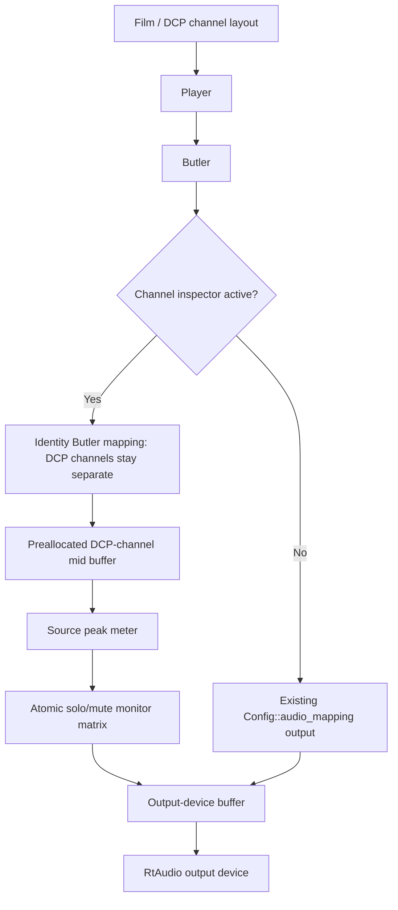
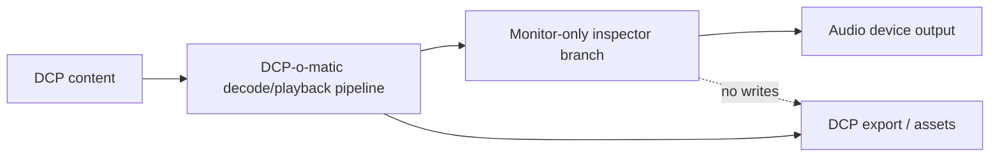

# DCP-o-matic Player monitor-only Channel Inspector

## Purpose

Add a Player-only monitoring tool for DCP audio QC.

The feature lets a user verify channel assignment and channel activity during
playback by soloing or muting individual DCP audio channels and watching source
channel peak levels.

This design deliberately excludes room tuning, playback EQ, diagnostic filters,
X-curve processing, measurement workflows, and export changes.

## Scope

| Included | Excluded |
|---|---|
| `Tools > Channel inspector...` window | Room EQ / REW / EQ-APO loading |
| Per-channel solo | X-curve, Flat, or diagnostic EQ presets |
| Per-channel mute | iPhone measurement workflow |
| Per-channel dBFS peak display | DCP export or asset modification |
| Monitor-only playback routing | DKDM/libxml maintenance fixes |

## User Workflow

1. Open a DCP in DCP-o-matic Player.
2. Start playback.
3. Open `Tools > Channel inspector...`.
4. Solo or mute channels while listening.
5. Use the peak column to confirm whether each source channel contains signal.
6. Close the window to clear monitoring state and return to normal playback.

## Architecture

## Trust Boundaries

The inspector changes only the live monitoring output while the Player is
running. It does not write DCP files, modify CPL metadata, change audio assets,
or affect export/encoding paths.

## Implementation Structure

| File | Responsibility |
|---|---|
| `src/wx/channel_inspector.h` | Realtime-safe state, source peak metering, and DCP-to-device downmix |
| `src/wx/channel_inspector_dialog.h` | Modeless wxFrame with channel rows, solo/mute controls, and peak labels |
| `src/wx/film_viewer.h` | Owns inspector state and exposes UI forwarding methods |
| `src/wx/film_viewer.cc` | Recreates Butler in identity mode while active; branches the audio callback |
| `src/tools/dcpomatic_player.cc` | Adds the Tools menu item and owns the modeless inspector window |

## Audio Callback Behavior

When inactive, Player uses the existing callback path unchanged.

When active:

1. `FilmViewer` recreates `Butler` with identity mapping and DCP channel count.
2. `Butler::get_audio()` fills a preallocated intermediate buffer in DCP channel order.
3. `ChannelInspector::meter()` records peak levels before solo/mute/downmix.
4. `ChannelInspector::downmix()` writes the configured output-device buffer using the current atomic gain matrix.

If the callback receives more frames than the configured intermediate buffer can
hold, the inspector path emits silence for that callback instead of overrunning
the buffer.

## Concurrency Notes

| State | Writer | Reader | Safety model |
|---|---|---|---|
| Active flag | UI thread | Audio callback | `std::atomic<bool>` |
| Routing gains | UI thread | Audio callback | Per-cell `std::atomic<float>` |
| Peak values | Audio callback | UI timer | `std::atomic<float>` |
| Intermediate buffer | Audio callback only while active | Audio callback | Allocated during Butler recreation, before callback use |

The audio callback path avoids allocation and locks. The UI thread may rebuild
the monitor matrix when solo/mute state changes.

## Routing Semantics

Solo is solo-in-place. The selected channel keeps the user's normal
`Config::audio_mapping()` routing; all non-soloed channels are removed from the
monitor output. This avoids forcing a channel into both stereo speakers and
makes the inspector behave like a monitor isolation control rather than a new
downmix policy.

Mute always removes the muted channel from the monitor output.

When no solo is active, all unmuted channels use the normal configured mapping.

## Verification

Completed checks:

| Check | Result |
|---|---|
| Standalone engine harness | PASS |
| Patch scope scan for room/EQ/DKDM terms | PASS |
| `git apply --check` on clean v2.18.44 source | PASS |
| Full DCP-o-matic build through `dcpomatic2_player` | PASS |

Manual playback QA still required before PR:

1. Stereo/headphone output with a 5.1 DCP.
2. Multichannel output device if available.
3. Solo L/R/C/LFE/Ls/Rs one by one.
4. Mute each channel during playback.
5. Confirm peak labels update for active source channels.
6. Close/reopen the window and confirm state resets.
