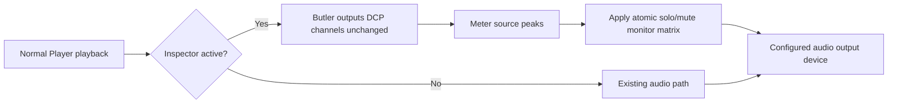

# DCP-o-matic Player monitor-only Channel inspector

This patch adds a monitor-only channel inspection window to DCP-o-matic Player.

It is intentionally narrow:

- per-DCP-channel `Solo`
- per-DCP-channel `Mute`
- per-DCP-channel peak level display in dBFS
- no playback EQ
- no room tuning
- no DCP/export modification

## Base

- DCP-o-matic: `v2.18.44`
- Verified local source commit: `21ec427fdaf18293f38ac780f626212323d6bf1c`
- Target binary: `dcpomatic2_player`

## Files changed by the patch

| File | Change |
|---|---|
| `src/tools/dcpomatic_player.cc` | Adds `Tools > Channel inspector...` menu item and modeless window ownership |
| `src/wx/film_viewer.h` | Adds inspector state and UI forwarding methods |
| `src/wx/film_viewer.cc` | Adds delayed identity Butler mode and monitor-only callback downmix path |
| `src/wx/channel_inspector.h` | New realtime-safe monitor engine |
| `src/wx/channel_inspector_dialog.h` | New wx window with solo/mute controls and peak labels |

## How it works



The normal player path is left alone until the inspector window is opened. When
the window opens, `FilmViewer` recreates its `Butler` with an identity mapping
so the audio callback receives the original DCP channel layout. The callback
then meters each source channel and downmixes to the user's configured output
device using the current solo/mute matrix.

Solo is solo-in-place: it keeps the channel's normal DCP-o-matic output mapping
and silences the other channels. For example, if the configured mapping sends C
to both L/R in stereo monitoring, soloing C keeps that same monitor placement.

## Apply

```bash
cd ~/src/dcpomatic
git checkout v2.18.44
CHANNEL_INSPECTOR_REPO=/Users/homedcp/Claude/Projects/dcpomatic-channel-inspector
git apply "$CHANNEL_INSPECTOR_REPO/patches/dcpomatic-channel-inspector/0001-add-monitor-only-channel-inspector.patch"
```

## Build On macOS

The local Apple Silicon build used this shape:

```bash
python3 ./waf configure --prefix=$HOME/dcpomatic-env \
  --wx-config="$(brew --prefix wxwidgets)/bin/wx-config" \
  --c++17 --disable-tests
python3 ./waf build
```

For a fuller walkthrough, see `docs/channel-inspector-build-and-use.md`.

## Use

1. Launch the rebuilt `dcpomatic2_player`.
2. Open a DCP.
3. Start playback.
4. Open `Tools > Channel inspector...`.
5. Tick `Solo` on one or more channels to isolate them in the monitor output.
6. Tick `Mute` to remove channels from the monitor output.
7. Watch the `Peak` column to confirm channel activity.
8. Close the window to clear solo/mute state and return to the normal playback path.

## Standalone engine check

```bash
clang++ -std=c++17 -I patches/dcpomatic-channel-inspector \
  patches/dcpomatic-channel-inspector/tests/inspector_harness.cc \
  -o /tmp/dcpomatic_channel_inspector_harness
/tmp/dcpomatic_channel_inspector_harness
```

Expected result:

```text
== ALL PASS (0 failures) ==
```

## License

The patch is intended for contribution to DCP-o-matic and follows the same
GPL-2.0-or-later licensing notice used by the DCP-o-matic source files it
modifies. See the repository root `LICENSE` file for the full GPL v2 text.
